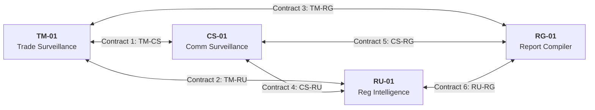

# Agent Capability Matrix, Pairwise Boundary Contracts & Gap Analysis
**System:** Meridian Global Bank Multi-Agent Compliance Monitoring System (Project 1B)  
**Document Code:** `D5-CM-v2.0`  
**Classification:** Tier-2 Global Banking Architecture Specification  
**Author:** AI Systems Architect, Zetheta Algorithms  

---

## 1. Comprehensive Cross-Agent Capability Matrix

The table below delineates functional responsibilities, operational constraints, and non-overlapping ownership among the four autonomous agents:

```
+-----------------------------------------------------------------------------------------------------------------------+
| SURVEILLANCE CAPABILITY                      | TM-01 (TRANSACTION) | CS-01 (COMMUNICATION) | RU-01 (REGULATION) | RG-01 (REPORTING)  |
+-----------------------------------------------------------------------------------------------------------------------+
| High-Throughput Streaming Ingestion (2.4M)   | PRIMARY (Kafka 32P) | NO                    | NO                 | NO                 |
| Level-2/3 Order Book Reconstruction          | PRIMARY (RocksDB)   | NO                    | NO                 | NO                 |
| High-Frequency Spoofing / Layering Detection | PRIMARY (<50ms SLA) | NO                    | NO                 | NO                 |
| Cross-Account Wash Trading Matching          | PRIMARY (Graph Math)| SUPPORTING            | NO                 | NO                 |
| Multimodal Audio & Text NLP Surveillance     | NO                  | PRIMARY (850k/day)    | NO                 | NO                 |
| Chinese Wall Information Barrier Enforcement | SUPPORTING (Trades) | PRIMARY (Chats/Email) | NO                 | NO                 |
| Misleading Marketing & Unsuitable Advice     | NO                  | PRIMARY (Transformers)| NO                 | NO                 |
| Off-Channel Evasion Hunting (WhatsApp)       | NO                  | PRIMARY (Regex/NLP)   | NO                 | NO                 |
| Global Regulatory Scraping (23 Authorities)  | NO                  | NO                    | PRIMARY (15m Poll) | NO                 |
| Statutory Text Vectorization & Rule Diffing  | NO                  | NO                    | PRIMARY (ChromaDB) | NO                 |
| Cross-Jurisdiction Legal Conflict Detection  | NO                  | NO                    | PRIMARY (Escrow)   | NO                 |
| Sanctions List & SDN Delta Dissemination     | CONSUMES            | CONSUMES              | PRIMARY (<60s SLA) | NO                 |
| Automated SAR/STR Regulatory Compilation     | DATA PROVIDER       | DATA PROVIDER         | STATUTE PROVIDER   | PRIMARY (XML/PDF)  |
| Multi-Audience Dashboard Presentation        | NO                  | NO                    | NO                 | PRIMARY (4 Profiles|
| Tamper-Evident Merkle Proof Sealing          | SIGNS TELEMETRY     | SIGNS TELEMETRY       | SIGNS UPDATES      | PRIMARY (Seals)    |
+-----------------------------------------------------------------------------------------------------------------------+
```

---

## 2. Pairwise Boundary Contracts Across All Six Agent Pairs

To enforce zero architectural overlap and prevent race conditions, explicit pairwise boundary contracts govern all machine interfaces:



### 2.1 Contract 1: `TM-01` $\longleftrightarrow$ `CS-01` (Structured Data vs Unstructured NLP)
* **Separation of Concerns:** `TM-01` strictly processes numerical, temporal, and account entity data. `CS-01` strictly processes natural language text, voice transcripts, and communication relationship graphs.
* **Interface Specification:** When `TM-01` flags a trading anomaly, it transmits a signed `query.comm.v1` to `CS-01` specifying `{trader_id, account_id, instrument, timestamp_window}`. `CS-01` returns `response.comm.v1` containing tokenized chat excerpts, intent classifications, and sentiment scores.
* **Boundary Invariant:** `TM-01` is strictly forbidden from parsing text; `CS-01` is strictly forbidden from calculating order book dynamics or position limits.

### 2.2 Contract 2: `TM-01` $\longleftrightarrow$ `RU-01` (Quantitative Execution vs Statutory Rule Vectors)
* **Separation of Concerns:** `RU-01` acts as a pure regulatory intelligence provider. `TM-01` consumes rule updates to dynamically calibrate numerical surveillance parameters.
* **Interface Specification:** `RU-01` publishes `update.regulatory.v1` containing numerical threshold deltas (e.g., initial swap margin increases in CS-07 or updated large trader reporting limits). `TM-01` updates its in-memory RocksDB rule tables within **< 10 seconds** of receipt.
* **Boundary Invariant:** `RU-01` never monitors live trading orders; `TM-01` never directly crawls external regulatory gazettes or EDGAR filings.

### 2.3 Contract 3: `TM-01` $\longleftrightarrow$ `RG-01` (Real-Time Detection vs Legal Filing Compilation)
* **Separation of Concerns:** `TM-01` detects anomalies in stream time ($< 50\text{ ms}$). `RG-01` compiles legally admissible filing packages and historical audit dossiers.
* **Interface Specification:** `TM-01` exports standardized structured trade tables and execution charts via `alert.transaction.v1` to the consensus orchestrator. Upon human signoff, `RG-01` ingests these tables and formats them into FinCEN SAR XML or SEC Form 8-K attachments.
* **Boundary Invariant:** `TM-01` never formats or transmits regulatory filings; `RG-01` never performs real-time market anomaly detection.

### 2.4 Contract 4: `CS-01` $\longleftrightarrow$ `RU-01` (Natural Language Context vs Statutory Lexicons)
* **Separation of Concerns:** `RU-01` identifies updates to statutory definitions, legal conduct standards, and newly sanctioned individual names. `CS-01` incorporates these changes into its transformer tokenizers and vector similarity lexicons.
* **Interface Specification:** `RU-01` broadcasts `update.lexicon.v1` to `CS-01`. `CS-01` dynamically inserts new keyword vectors and code names into ChromaDB collection `compliance_lexicons_v1`.
* **Boundary Invariant:** `RU-01` never monitors employee communication traffic; `CS-01` never interprets legal circulars.

### 2.5 Contract 5: `CS-01` $\longleftrightarrow$ `RG-01` (Communication Evidence vs Narrative Filing)
* **Separation of Concerns:** `CS-01` discovers and scores evidence of conversational collusion or conduct violations. `RG-01` synthesizes these excerpts into legally admissible narrative chronologies.
* **Interface Specification:** `CS-01` exports cryptographically signed transcripts with redactions for non-public personal information (NPI). `RG-01` embeds the verified transcripts into the narrative section of the SAR/STR filing.
* **Boundary Invariant:** `CS-01` does not generate regulatory report documents; `RG-01` does not execute NLP inference on raw message streams.

### 2.6 Contract 6: `RU-01` $\longleftrightarrow$ `RG-01` (Regulatory Rules vs Filing Deadlines & Schemas)
* **Separation of Concerns:** `RU-01` tracks statutory filing schemas and reporting deadline rules across 23 regulators. `RG-01` compiles documents matching those exact schemas and enforces filing countdown clocks.
* **Interface Specification:** `RU-01` provides statutory template definitions (e.g., FinCEN XML schema version 2.0, FIU-IND XML schema) and deadline parameters (e.g., GDPR 72-hour clock, FinCEN 30-day clock) to `RG-01`.
* **Boundary Invariant:** `RU-01` never generates or signs client filing documents; `RG-01` never scrapes regulatory endpoints for rule updates.

---

## 3. Compliance Gap Analysis & Mitigation Strategies

```
+---------------------------------------------------------------------------------------------------+
| IDENTIFIED SURVEILLANCE GAP               | RISK PROFILE | ARCHITECTURAL MITIGATION STRATEGY      |
+---------------------------------------------------------------------------------------------------+
| 1. Encrypted Off-Channel Mobile Devices   | Critical     | Lexical migration hunting (CS-01); QR  |
|    (Personal WhatsApp, Signal, WeChat)    |              | code detection; supervisory device logs|
| 2. Physical In-Person Collusion           | High         | Correlation of corporate badge swipes, |
|    (Off-site private dinners, meetings)   |              | expense reports, and visitor registries|
| 3. Cross-Market Synthetic Manipulation    | High         | Multi-asset graph correlation; OTC     |
|    (Equities vs Equity Swaps vs Options)  |              | derivative delta-equivalent matching   |
| 4. Cross-Border Sovereignty Conflicts     | Critical     | Automated legal escrow queue (CS-19);  |
|    (EMIR vs Singapore MAS Secrecy)        |              | immediate Tier 4 General Counsel alert |
| 5. Novel Market Abuse Patterns (Zero-Day) | Medium       | Unsupervised autoencoders & isolation  |
|    (Unknown algorithmic gaming methods)   |              | forests running parallel to rule tests |
+---------------------------------------------------------------------------------------------------+
```

---

## 4. Individual Agent Performance SLAs & Quality Targets

To ensure institutional reliability under extreme market stress, each agent operates under legally enforceable operational Service Level Agreements:

```
+---------------------------------------------------------------------------------------------------+
| AGENT  | THROUGHPUT TARGET    | 99TH PERCENTILE LATENCY | MINIMUM PRECISION | MINIMUM RECALL RATE |
+---------------------------------------------------------------------------------------------------+
| TM-01  | >= 35,000 txns/sec   | < 50 milliseconds       | >= 94.0%          | >= 98.5%            |
| CS-01  | >= 350 msgs/sec      | < 500 milliseconds      | >= 89.5%          | >= 96.0%            |
| RU-01  | >= 50 circulars/min  | < 60 seconds (SDN lists)| >= 99.0%          | >= 99.5%            |
| RG-01  | >= 120 filings/min   | < 15 minutes (SAR draft)| >= 99.9%          | 100.0% (Zero Drops) |
+---------------------------------------------------------------------------------------------------+
```
