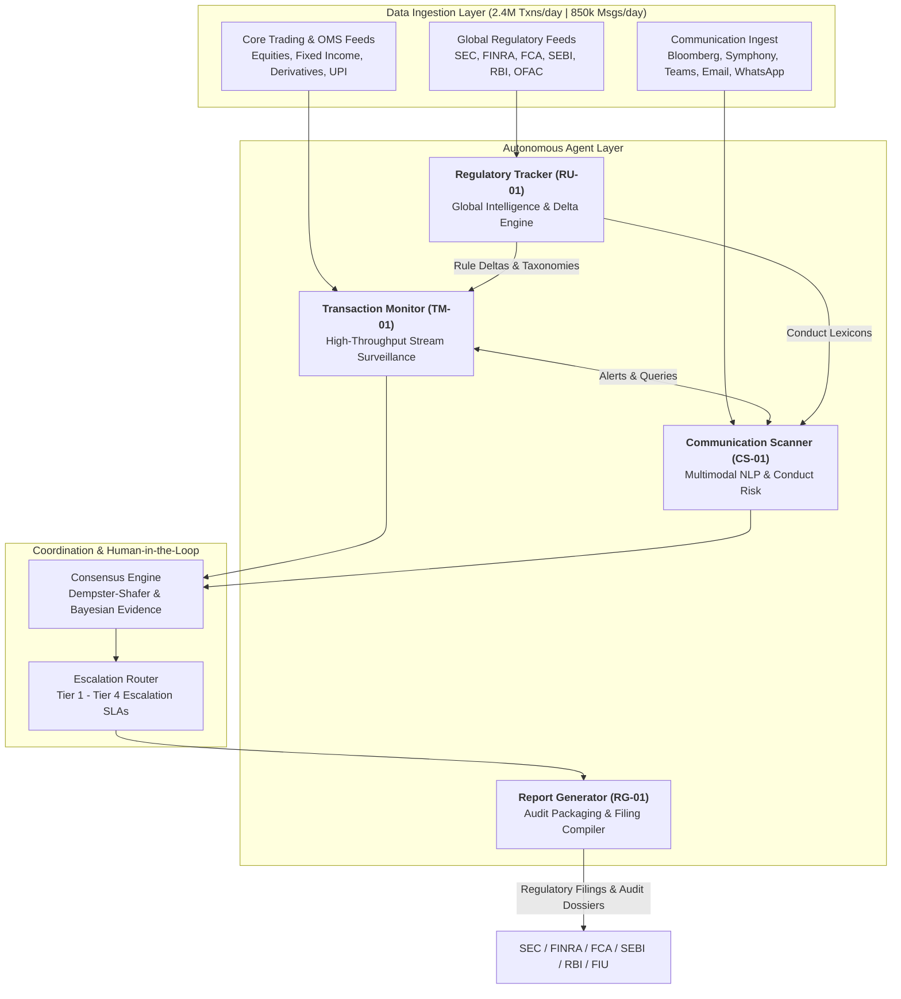

# Agent Registry & Specification Catalog
**System:** Meridian Global Bank Multi-Agent Compliance Monitoring System (Project 1B)  
**Document Code:** `D1-AR-v1.0`  
**Classification:** Restricted / Tier-2 Global Banking Architecture  
**Target Institution:** Meridian Global Bank ($450B AUM, 18,000 Employees, 12 Operating Countries)  

---

## 1. Architectural Overview & Agent Roster

The Meridian Multi-Agent Compliance Monitoring System is engineered around four primary autonomous agents. Each agent operates with specialized domain competencies, distinct state boundaries, deterministic input/output schemas, and dedicated computational allocations.

---

## 2. Agent 1: Transaction Monitor (`TM-01`)

### 2.1 Identity & Functional Mandate
* **Agent Identifier:** `TM-01`
* **Canonical Name:** Structured Transaction & Market Abuse Surveillance Monitor
* **Primary Role:** Real-time and near-real-time streaming surveillance across all trading desks (cash equities, fixed income, OTC derivatives, foreign exchange, commodities) and consumer payment flows (including instant payment networks such as India's UPI).
* **Target Enforcement Scope:** SEC Rule 10b-5, Dodd-Frank Section 747, CEA Section 4c, FINRA Rules 5210/5270/5310, MAR Articles 14/15, SEBI PIT & PFUTP Regulations, Bank Secrecy Act / FinCEN structuring rules.

### 2.2 Core Capabilities
1. **Microsecond Spoofing & Layering Detection:** Analyzes high-frequency order book cancellations (order-to-trade ratios > 30:1, cancellations within 200–500ms of entry) on CME, LSE, and NSE/BSE.
2. **Wash Trading Correlation:** Identifies self-matching or matched-order circular trading across coordinated internal accounts within tight price bands (≤ 2 bps) and near-zero economic risk shift.
3. **Front-Running & Order Anticipation:** Detects personal account trading (employee/prop desk) executing 10–30 minutes prior to large institutional client order blocks.
4. **Currency Structuring (Smurfing):** Aggregates cross-branch cash deposits and transfers strategically placed below statutory reporting thresholds ($10,000 for FinCEN CTR; ₹10,00,000 for India PMLA).
5. **Portfolio Concentration & Prospectus Violations:** Tracks UCITS, 1940 Act, and fund prospectus limits in real time (e.g., sector cap breaches persisting across multi-day windows).
6. **False-Positive Suppression Engine:** Validates legitimate institutional block trading (e.g., pre-negotiated program rebalancing, crossing network transactions) against documented compliance exemptions.

### 2.3 Computational Allocation & Pod Topology
* **Runtime Environment:** Kubernetes Pod Cluster (`meridian-tm-core`)
* **vCPU Allocation:** 64 vCPU (Baseline: 32 cores for Flink/Kafka stream consumers, 32 cores for temporal feature calculation).
* **RAM:** 256 GB ECC RAM (High-memory allocation for in-memory rolling order-book sliding windows: 1-hour, 4-hour, 24-hour, and 20-day state stores).
* **Storage:** 2 TB NVMe local cache (RocksDB state backend for stateful stream processing).
* **Autoscaling Policy:** Horizontal Pod Autoscaler (HPA) targeting 65% CPU utilization; scales from 8 worker nodes to 24 worker nodes during peak market hours (US/EU market open overlap: 13:30–16:30 UTC).

### 2.4 Interface & Schema Contract
* **Inputs:**
  * Kafka Topic: `meridian.transactions.v1` (Protobuf/AVRO formatted; average 2.4 million events/day; peak 35,000 msgs/sec).
  * Reference Master: FIX 4.4 / 5.0 order flow, trade confirmation feeds, SWIFT MT103/202, ISO 20022 camt/pacs payment streams.
* **Outputs:**
  * Kafka Topic: `meridian.compliance.alerts.v1` (Schema: `alert.transaction.v1`).
  * Inter-Agent Queries to `CS-01`: Query requests for employee communication traces surrounding anomalous trades (`query.comm.v1`).
* **Latency SLAs:**
  * Real-time Order Book Abuse (Spoofing/Layering): **< 50 milliseconds**.
  * Complex Wash Trading & Structuring Aggregation: **< 15 seconds**.
  * Multi-Day Rolling Pattern Analysis: **< 5 minutes**.

---

## 3. Agent 2: Communication Scanner (`CS-01`)

### 3.1 Identity & Functional Mandate
* **Agent Identifier:** `CS-01`
* **Canonical Name:** Multichannel Communication & Conduct Risk Surveillance Scanner
* **Primary Role:** Continuous semantic, sentiment, intent, and information barrier surveillance across all bank-sanctioned communication channels and detected off-channel vectors.
* **Target Enforcement Scope:** SEC Rule 17a-4, FINRA Rules 2111/2210/3110, SEC Regulation Best Interest (Reg BI), SEC Regulation AC, FCA COBS 4/9, MiFID II Article 16, GDPR Article 44–49 cross-border data transfer rules.

### 3.2 Core Capabilities
1. **Multimodal Lexicon & Semantic NLP:** Ingests and analyzes text and voice transcripts across 4 mandatory languages (English, Mandarin, Hindi, Spanish) using transformer-based domain embeddings.
2. **Information Barrier (Chinese Wall) Surveillance:** Monitors and alerts on unauthorized communication between private-side teams (M&A, ECM, DCM) and public-side desks (Equity Research, Sales & Trading).
3. **Unsuitable Recommendation & Coercive Sales Detection:** Identifies misleading claims (e.g., "guaranteed 12% return", "zero risk") directed at vulnerable or retirement account clients.
4. **Off-Channel Communication Hunting:** Scans for indicators of unapproved channel migration (e.g., "message me on WhatsApp", "check Signal", sharing QR codes or personal phone numbers).
5. **Research Independence Verification:** Flags interactions between investment bankers and research analysts that precede rating revisions or IPO/secondary offerings (Regulation AC & FINRA Rule 2241).
6. **Elder Financial Exploitation Signals:** Correlates sharp shifts in account trading velocity with communications originating from newly authorized Power of Attorney (POA) holders.

### 3.3 Computational Allocation & Pod Topology
* **Runtime Environment:** Kubernetes GPU/NPU Node Pool (`meridian-cs-nlp`)
* **Hardware Accelerators:** 4x NVIDIA L40S GPUs (48GB VRAM each) for low-latency batch transformer inference and semantic embedding generation.
* **vCPU Allocation:** 32 vCPU.
* **RAM:** 128 GB RAM.
* **Storage:** 1 TB High-IOPS SSD.
* **Autoscaling Policy:** Scales dynamically from 4 pods to 12 pods based on incoming message backlog in Kafka `meridian.communications.v1`.

### 3.4 Interface & Schema Contract
* **Inputs:**
  * Kafka Topic: `meridian.communications.v1` (850,000 daily communications across Symphony, Bloomberg Chat, MS Teams, Exchange Email, Cisco Voice Transcripts).
  * Direct Query Requests from `TM-01`: Targeted time-window lookups for specific trader IDs and ticker symbols.
* **Outputs:**
  * Kafka Topic: `meridian.compliance.alerts.v1` (Schema: `alert.communication.v1`).
  * Direct Correlation Responses to `TM-01`: Rich communication evidence packages (`response.comm.v1`).
* **Latency SLAs:**
  * Real-time Chat/Email Scanning: **< 500 milliseconds**.
  * Audio Transcription & Complex Semantic Ingestion: **< 10 seconds**.
  * Cross-Channel Chinese Wall Dossier Generation: **< 30 seconds**.

---

## 4. Agent 3: Regulatory Update Tracker (`RU-01`)

### 4.1 Identity & Functional Mandate
* **Agent Identifier:** `RU-01`
* **Canonical Name:** Global Regulatory Intelligence & Delta Assessment Tracker
* **Primary Role:** Autonomous ingestion, structural parsing, semantic diffing, and system impact analysis of regulatory issuances across 23 global and domestic regulatory authorities.
* **Target Enforcement Scope:** SEC, FINRA, OCC, CFPB, CFTC (US); FCA, PRA, ESMA, EBA (UK/EU); MAS (Singapore); HKMA (Hong Kong); SEBI, RBI, FIU-IND (India); OFAC, FATF (Multilateral/Sanctions).

### 4.2 Core Capabilities
1. **Continuous Regulatory Scraping & Feed Ingestion:** Polls and web-hooks official gazettes, regulatory APIs, Federal Register, SEBI circulars, and RBI notifications at 15-minute intervals.
2. **Semantic Rule Diffing & Vectorization:** Chunks and embeds incoming rules into ChromaDB (`global_regulations_v1`), detecting amendments to existing margin requirements, capital adequacy ratios, or sanctions lists.
3. **Cross-Jurisdiction Conflict Identification:** Analyzes mutual legal contradictions across borders (e.g., EMIR 1-day OTC derivatives reporting mandate vs. Singapore MAS personal data secrecy laws in CS-19).
4. **Sanctions & Watchlist Propagation:** Ingests OFAC SDN, EU, and UN sanctions updates, broadcasting immediate transaction-hold rules to `TM-01` within seconds of publication.
5. **Compliance Policy Delta Synthesis:** Generates automated change tickets detailing impacted internal policies, affected trading desks, and technical surveillance parameter adjustments.

### 4.3 Computational Allocation & Pod Topology
* **Runtime Environment:** Kubernetes Pod Cluster (`meridian-ru-intel`)
* **vCPU Allocation:** 16 vCPU.
* **RAM:** 64 GB RAM.
* **Storage:** 500 GB NVMe Storage (ChromaDB vector indices and legal text archives).
* **Autoscaling Policy:** Fixed 2-replica high-availability configuration with active-passive failover.

### 4.4 Interface & Schema Contract
* **Inputs:**
  * External Ingest Connectors: SEC EDGAR RSS, FINRA Regulatory Notices, OFAC SDN XML/JSON Feed, SEBI Circulars Scraping Hook, RBI Notification API, FCA Handbook Feed.
* **Outputs:**
  * Broadcast Topic: `meridian.compliance.regulatory_updates.v1` (Schema: `update.regulatory.v1`).
  * Direct Configuration Updates: Vector updates to `CS-01` lexicons and parameter adjustments to `TM-01` threshold filters.
* **Latency SLAs:**
  * Emergency Sanctions List (OFAC SDN) Processing: **< 60 seconds from publication**.
  * Standard Circular / Final Rule Analysis: **< 15 minutes**.
  * Cross-Border Conflict Evaluation Matrix: **< 1 hour**.

---

## 5. Agent 4: Report Generator (`RG-01`)

### 5.1 Identity & Functional Mandate
* **Agent Identifier:** `RG-01`
* **Canonical Name:** Automated Compliance Reporting & Regulatory Filing Compiler
* **Primary Role:** Synthesis of multi-agent alert packages, evidence dossiers, and human decision rationales into legally binding regulatory filings, board dashboards, and audit-grade packages.
* **Target Enforcement Scope:** FinCEN Suspicious Activity Reports (SAR), Form 8-K disclosures, Form N-PORT filings, UK/EU Suspicious Transaction and Order Reports (STOR), India FIU-IND Suspicious Transaction Reports (STR), Board Risk Committee Quarterly Reports.

### 5.2 Core Capabilities
1. **Automated SAR/STR Narrative Synthesis:** Compiles multi-agent evidence (trade logs, chat excerpts, regulatory citations) into standardized SAR narratives complying with FinCEN and FIU-IND formatting rules.
2. **Multi-Audience Format Adaptation:** Converts identical compliance incident dossiers into four tailored presentation levels:
   * *Board Level:* Strategic exposure, fine mitigation, reputational risk metrics.
   * *Executive Management:* Operations impact, supervisory remediation steps.
   * *Compliance Operations:* Granular audit trails, technical detection timestamps.
   * *Regulators:* Formal statutory disclosures (XBRL, XML, PDF/A-1b).
3. **Cryptographic Proof Stamping:** Embeds SHA-256 Merkle proofs and agent digital signatures into every exported report to guarantee evidentiary immutability.
4. **Filing Deadline SLA Tracker:** Monitors statutory countdown clocks (e.g., GDPR 72-hour breach notification, FinCEN 30-day SAR window) and triggers automated escalation warnings.

### 5.3 Computational Allocation & Pod Topology
* **Runtime Environment:** Kubernetes Pod Cluster (`meridian-rg-compiler`)
* **vCPU Allocation:** 16 vCPU.
* **RAM:** 48 GB RAM.
* **Storage:** 1 TB Encrypted Storage (Document staging and signed PDF/XML repository).
* **Autoscaling Policy:** Autoscales from 2 to 6 pods based on scheduled end-of-day/end-of-month reporting batches and sudden critical filing surges.

### 5.4 Interface & Schema Contract
* **Inputs:**
  * Escalation Queue: `agent.escalation.resolved` (Completed investigations signed by Compliance Officers).
  * Direct Feed: Query access to PostgreSQL immutable audit ledger and TimescaleDB event archives.
* **Outputs:**
  * Regulatory Filing Packages: FinCEN SAR XML, FIU-IND STR format, SEC EDGAR Form 8-K ASCII/HTML, PDF/A-1b dossiers.
  * Internal Audit Archive: Permanent storage write to WORM (Write Once Read Many) AWS S3 Glacier Vault.
* **Latency SLAs:**
  * Event-Triggered Critical SAR/STR Draft Compilation: **< 15 minutes** from human resolution.
  * Routine Daily Surveillance Summary: **< 30 minutes** post market close.
  * Comprehensive Annual / Board Level Compliance Dossier: **< 2 hours**.

---

## 6. Comprehensive Cross-Agent Resource & Capability Matrix

| Attribute / Metric | Transaction Monitor (`TM-01`) | Communication Scanner (`CS-01`) | Regulatory Tracker (`RU-01`) | Report Generator (`RG-01`) |
| :--- | :--- | :--- | :--- | :--- |
| **Primary Workload** | High-throughput streaming analytics | Transformer NLP & multimodal audio/text | Web ingestion, rule parsing & vector search | Document synthesis, template styling & crypto signing |
| **Compute Profile** | Compute & Memory Bound | GPU Acceleration Bound | I/O & Vector Index Bound | CPU & I/O Bound |
| **Allocated vCPU / RAM** | 64 vCPU / 256 GB RAM | 32 vCPU / 128 GB RAM + 4x L40S | 16 vCPU / 64 GB RAM | 16 vCPU / 48 GB RAM |
| **Peak Throughput** | 35,000 transactions / second | 250 communications / second | 50 feed documents / minute | 120 completed filings / minute |
| **State Storage** | RocksDB (2TB local NVMe) | ChromaDB Local Cache (1TB) | ChromaDB Global Store (500GB) | Encrypted Staging (1TB) |
| **Primary Ingest Feed** | Core Trading, FIX, SWIFT, UPI | Teams, Symphony, Email, WhatsApp | SEC, FINRA, FCA, SEBI, RBI | Resolved Alert Packages & Audit DB |
| **Primary Outbound Feed** | Kafka `compliance.alerts.v1` | Kafka `compliance.alerts.v1` | Kafka `regulatory_updates.v1` | Regulatory Gateways & WORM Storage |
| **Fault Recovery Model** | Kafka Offset Replay from Checkpoint | Queue Rebalance & Checkpoint Resume | Idempotent Re-crawl & Cache Sync | Temporal Workflow Replay |
