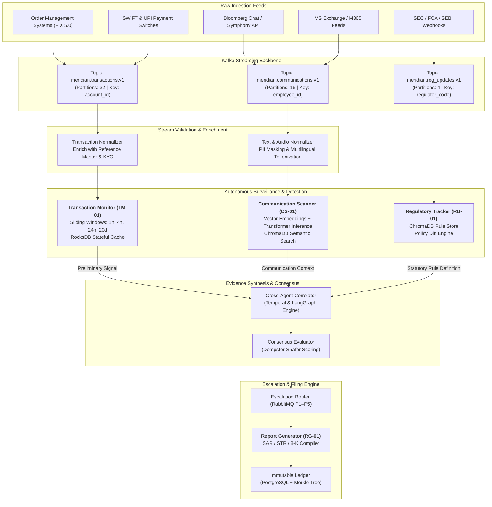

# Data Flow Architecture & Ingestion Pipeline Specification
**System:** Meridian Global Bank Multi-Agent Compliance Monitoring System (Project 1B)  
**Document Code:** `D1-DF-v1.0`  
**Classification:** Tier-2 Global Banking System Architecture  
**Author:** AI Systems Architect, Zetheta Algorithms  

---

## 1. High-Volume Ingestion Profile & Throughput Mathematics

Meridian Global Bank operates across 12 countries, executing over **2.4 million daily transactions** and generating **850,000 daily business communications**. The data flow architecture must guarantee zero data loss, sub-second anomaly detection for critical market abuse, and strict temporal event ordering.

### 1.1 Ingestion Throughput Calculations

```
+------------------------------------------------------------------------------------------------+
| METRIC                               | DAILY VOLUME     | AVG THROUGHPUT   | PEAK THROUGHPUT (5x AVG)  |
+------------------------------------------------------------------------------------------------+
| Core Trading Orders & Executions     | 2,400,000 txns   | ~28.0 txns/sec   | ~35,000 txns/sec (Burst)  |
| Multimodal Communications            | 850,000 messages | ~9.8 msgs/sec    | ~350 msgs/sec (Peak)      |
| Regulatory Circulars & Scraping Feeds| 4,000 documents  | ~0.05 docs/sec   | ~10 docs/sec              |
| Audit Log & Trace Events             | 18,500,000 events| ~214 events/sec  | ~2,500 events/sec         |
+------------------------------------------------------------------------------------------------+
```

* **Peak Volume Dynamics:** Equity and derivatives order flow is concentrated during market open and close auctions (e.g., US market open 09:30–10:00 EST and London/NY overlap). Peak burst capacity is dimensioned for **50,000 transactions per second**.
* **Daily Ingestion Bandwidth:**
  * Average Transaction Event Size: 1.2 KB (Protobuf encoded).
  * 2.4M transactions = **2.88 GB raw data/day**.
  * Average Communication Message Size (including text, attachments metadata, audio transcript chunks): 18 KB.
  * 850k communications = **15.3 GB raw data/day**.
  * Total daily analytical ingest: **~18.2 GB/day**, expanding to **~65 GB/day** with full intermediate feature states and distributed tracing spans.

---

## 2. End-to-End Data Ingestion Pathways



---

## 3. Detailed Data Pathways by Stream

### 3.1 Trading Operations Surveillance Pipeline (2.4M Txns/Day)
1. **Source Capture:** Execution Management Systems (EMS), Order Management Systems (OMS), and domestic payment gateways push trade lifecycle events (New Order, Fill, Cancel, Replace, Reject) formatted in FIX 4.4/5.0 and ISO 20022.
2. **Ingestion & Partitioning:** Events enter Kafka topic `meridian.transactions.v1`. To preserve strict causal order per trading entity, partitions are keyed on `account_id` (secondary indexing on `instrument_symbol`).
3. **Stream Enrichment:** A Flink streaming job normalizes incoming events into the unified `TransactionRecord` schema, enriching each transaction with:
   * Client Risk Rating & Entity Master (from core PostgreSQL).
   * Trader Desk ID, Supervisor ID, and Mandated Limits.
   * Real-time Market Benchmark Prices (from consolidated market feeds).
4. **Pattern Detection Engines (TM-01):**
   * *In-Memory Sliding Windows:* Evaluates millisecond cancel ratios for spoofing/layering (CME Rule 575), wash trade counterparty matching, and daily volume concentration.
   * *Long-Term Rolling State:* RocksDB persistent state stores maintain 20-day client trading baselines to flag unusual volume surges or sudden front-running timing.
5. **Output Routing:** Detected anomalies generate a signed `TransactionAlert` dispatched to Kafka topic `meridian.compliance.alerts.v1`.

### 3.2 Multichannel Communication Pipeline (850k Messages/Day)
1. **Feed Aggregation:** Connectors pull conversations from Bloomberg Chat, Symphony, Microsoft Teams, corporate Exchange email, and recorded dealer voice lines (transcribed via Whisper speech-to-text models).
2. **PII Masking & Tokenization:** Inbound text is sanitized to mask customer non-public personal information (NPI) according to GDPR and GLBA guidelines prior to model inference.
3. **NLP Surveillance (CS-01):**
   * *Lexicon & Heuristic Matcher:* Scans for explicit evasion phrases ("call me on my personal cell", "check WhatsApp", "take this off-record").
   * *Dense Semantic Embedding:* Texts are vectorized using domain-specific financial transformers and matched against indexed abuse vectors (coercion, misleading returns, insider disclosures) in ChromaDB.
   * *Information Barrier Tracker:* Graph adjacency matrix evaluates whether the sender and recipient violate Chinese Wall access boundaries (e.g., M&A analyst sending market color to Equity Sales).
4. **Output Routing:** Communication conduct flags are wrapped in `CommunicationAlert` and published for cross-correlation.

### 3.3 Regulatory Intelligence Pipeline (23 Global Authorities)
1. **Autonomous Crawling:** `RU-01` scheduled workers poll official endpoints across SEC EDGAR, FINRA Regulatory Notices, ESMA, FCA Handbook, SEBI circulars, and RBI Master Directions.
2. **Document Ingestion & Chunking:** New rules, circulars, and amendments are parsed from PDF/HTML into structured legal markdown, segmented into semantic clauses.
3. **Vectorization & Indexing:** Chunks are vectorized and indexed in ChromaDB collection `global_regulations_v1`.
4. **Delta Assessment:** A semantic comparison identifies policy deviations (e.g., SEC increasing uncleared swap margin requirements by 25% in CS-07).
5. **Rule Broadcast:** Emits `update.regulatory.v1` to update `TM-01` numerical filter parameters and `CS-01` surveillance vocabularies.

---

## 4. Latency SLAs, Watermarking & Backpressure Management

### 4.1 Latency Service Level Agreements (SLAs)

| Compliance Event Type | Detection Latency | Correlation Latency | Escalation SLA | Statutory Filing SLA |
| :--- | :--- | :--- | :--- | :--- |
| **Spoofing / Layering (CS-02)** | < 50 milliseconds | N/A (Direct) | < 15 minutes | Immediate internal desk freeze |
| **OFAC Sanctions Match (CS-09)** | < 100 milliseconds | < 2 seconds | < 5 minutes | Immediate wire hold / 10-day OFAC report |
| **Insider Trading (CS-01)** | < 30 seconds | < 15 seconds | < 2 hours | 30 Calendar Days (FinCEN SAR) |
| **Misleading Marketing (CS-08)** | < 500 milliseconds | N/A | < 1 hour | Immediate material retraction |
| **GDPR Cross-Border Breach (CS-11)** | < 5 seconds | < 30 seconds | < 1 hour | 72 Hours (DPA Notification) |
| **Trade-Based AML / Multi-Agent (CS-20)**| < 1 minute | < 45 seconds | < 30 minutes | 30 Calendar Days (SAR/STR) |

### 4.2 Stream Watermarking & Out-of-Order Handling
Trading events from international exchanges may arrive out-of-order due to network jitter across global WAN links. The ingestion pipeline implements **Bounded-Out-Of-Orderness Watermarking**:
* **Watermark Delay:** Fixed at **3,500 milliseconds**.
* Events arriving within the 3.5-second buffer window are inserted into the correct temporal order in the RocksDB sliding window.
* Events arriving beyond the late-arrival threshold trigger a late-data side-output stream for secondary historical reconciliation without stalling real-time stream evaluation.

### 4.3 Backpressure Strategy
Under sudden market flash crashes or high-volatility bursts (e.g., central bank rate surprises):
1. **Tier 1 (Kafka Buffer):** Partitions buffer incoming spikes up to 72 hours of retention without dropping records.
2. **Tier 2 (Dynamic Consumer Throttling):** Flink and Kafka consumers scale workers automatically via Kubernetes Horizontal Pod Autoscalers (HPA).
3. **Tier 3 (Degraded Surveillance Mode):** If consumer lag exceeds 45 seconds on `meridian.transactions.v1`, `TM-01` sheds low-priority exploratory queries (P5) while strictly guaranteeing that P1 (Spoofing, Wash Trading, Sanctions) real-time surveillance remains uncompromised.
