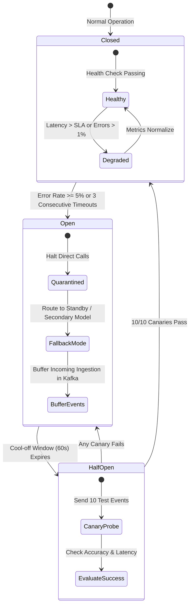

# Failure Modes, Circuit Breakers & State Recovery Specification
**System:** Meridian Global Bank Multi-Agent Compliance Monitoring System (Project 1B)  
**Document Code:** `D1-FM-v1.0`  
**Classification:** Tier-2 Global Banking System Architecture  
**Author:** AI Systems Architect, Zetheta Algorithms  

---

## 1. System Resilience Framework

A compliance surveillance failure at a Tier-2 bank can result in multi-million-dollar regulatory fines, criminal sanctions, and loss of banking licenses. The multi-agent architecture is engineered to guarantee an **RPO (Recovery Point Objective) of 0 seconds** (zero event loss) and an **RTO (Recovery Time Objective) of < 60 seconds** for all critical surveillance pipelines.



---

## 2. Component Failure Modes and Effects Analysis (FMEA)

| Failure ID | Affected Component | Failure Mode Description | Root Cause / Trigger | Severity (1-5) | System Impact | Automated Recovery Mechanism |
| :--- | :--- | :--- | :--- | :---: | :--- | :--- |
| **FM-01** | `TM-01` (Transaction Monitor) | Complete Worker Node Crash mid-trading day | OOM, hardware failure, Kubernetes node eviction | **5 (Critical)** | Potential surveillance blind spot during live market trading | Kafka Consumer Group rebalance to hot-standby pods; state re-hydrated from RocksDB checkpoint; offset catch-up replay. |
| **FM-02** | `CS-01` (Communication Scanner) | GPU Memory Exhaustion / Transformer Failure | Outsize batch audio transcription, memory leak | **4 (High)** | Communication processing latency spikes; queue buildup | Circuit breaker trips; fails over to lightweight lexical/heuristic CPU model; restarts GPU worker pods. |
| **FM-03** | `RU-01` (Regulatory Tracker) | External Regulatory Scraper / API Outage | Regulatory portal redesign, cloud network outage | **2 (Low)** | Delays detection of newly published circulars | Exponential backoff retry with jitter; falls back to secondary RSS/API feeds; alerts Compliance Admin. |
| **FM-04** | `RG-01` (Report Generator) | Compiler Crash during Critical Filing Window | Malformed data XML, disk saturation | **4 (High)** | At risk of missing statutory deadline (e.g. 72h GDPR) | Temporal workflow auto-retry with activity isolation; re-routes task to warm replica; escalates to Tier 3 human. |
| **FM-05** | Kafka Streaming Bus | Partition Broker Leader Outage | Network partition, disk I/O stall | **5 (Critical)** | Ingestion pause or client connection reset | Kafka In-Sync Replicas (`min.insync.replicas=2`); instantaneous broker leader election; producer local disk spooling. |
| **FM-06** | Vector Store (ChromaDB) | Vector Index Corruption or Read Timeout | High concurrent query load, storage corruption | **3 (Medium)** | Semantic similarity scoring unavailable | Reverts to exact keyword/regex lexicon scanning; triggers background index restore from S3 snapshot. |

---

## 3. Deep Dive: Critical Failure Scenarios & Recovery Procedures

### 3.1 Scenario FM-01: Transaction Monitor (TM-01) Offline Mid-Trading Day
* **Context:** At 14:15 UTC (peak London/New York market overlap), the primary `TM-01` pod cluster suffers an unexpected hypervisor crash.
* **Immediate System Response (< 5 Seconds):**
  1. Kafka broker detects lost heartbeat from `TM-01` consumer group (`meridian-tm-group`).
  2. Kafka coordinator triggers consumer group partition rebalance.
  3. Pre-warmed **Hot-Standby Pods** (`meridian-tm-standby`) claim the unassigned topic partitions.
* **State Reconstitution (< 30 Seconds):**
  1. The standby pods mount the distributed RocksDB state store synchronized from Amazon EBS / Ceph block storage.
  2. The last committed consumer offset is fetched from Kafka's internal `__consumer_offsets` topic.
* **Catch-Up Replay Mode (< 45 Seconds):**
  1. `TM-01` enters accelerated catch-up mode, processing the buffered event backlog at 4x normal ingestion speed (up to 140,000 txns/sec).
  2. Sliding windows for spoofing and wash trading are recalculated from the exact millisecond of the crash.
  3. Zero data loss is achieved ($RPO = 0$). Surveillance continuity is fully restored within 45 seconds ($RTO = 45s$).

### 3.2 Scenario FM-02: Communication Scanner (CS-01) NLP Queue Saturation
* **Context:** A sudden financial market shock causes communication volume across Bloomberg and Symphony to surge 10x above normal levels (3,500 msgs/sec), causing GPU VRAM saturation on `CS-01`.
* **System Protection via Progressive Degradation:**
  1. **Queue Watermark Trigger:** RabbitMQ / Kafka consumer lag on `meridian.communications.v1` exceeds 15,000 messages.
  2. **Circuit Breaker Trip:** The circuit breaker trips from `Closed` to `Open` for heavy transformer models (e.g., deep multi-turn intent parsers).
  3. **Fallback to Fast Lexical Heuristics:** Inbound messages are routed to high-throughput CPU-based regex and pattern scanners (processing 10,000 msgs/sec). Critical flags (coercion, leak keywords) continue detection without delay.
  4. **Autoscaling Invocations:** The Kubernetes HPA provisions 8 additional GPU worker nodes. Once the backlog is cleared and latency drops below 250ms, the circuit breaker resets to `Closed`.

---

## 4. Circuit Breaker Specification

Inter-agent communication relies on the **Polly/Resilience4j** pattern implemented in Python via `pybreaker`:

```python
# Production Circuit Breaker Configuration
CIRCUIT_BREAKER_CONFIG = {
    "fail_max": 5,                # Trip after 5 consecutive failures
    "reset_timeout": 60,          # Cool-off window before canary probe (seconds)
    "half_open_success_threshold": 10, # Consecutive successes required to close
    "exclude_exceptions": [
        "SchemaValidationError"   # Do not trip circuit on client data errors
    ]
}
```

* **Closed State:** Normal invocation. Metrics tracked: latency, error percentage, and CPU/GPU load.
* **Open State:** Downstream calls are blocked immediately; incoming requests receive an instant fallback response or are spooled to local NVMe queues.
* **Half-Open State:** After 60 seconds, 10 canary transactions are allowed through. If all 10 succeed, normal operation resumes; if any fails, the breaker returns to Open for another 120 seconds.

---

## 5. Disaster Recovery & State Synchronization

```
+---------------------------------------------------------------------------------------------------+
| COMPONENT              | REPLICATION TOPOLOGY         | SYNC FREQUENCY    | FAILOVER MECHANISM    |
+---------------------------------------------------------------------------------------------------+
| Apache Kafka           | 3-node cluster across 3 AZs  | Synchronous (ISR) | Automated Leader Elec |
| PostgreSQL Primary     | Primary-Replica with Patroni | Semi-Synchronous  | Auto Failover (<15s)  |
| ChromaDB Vector Store  | Read-replicas across nodes   | Async Snapshot (5m)| Automated DNS redirect|
| Redis Cache            | Redis Cluster with 6 nodes   | Synchronous (AOF) | Redis Sentinel Auto   |
| Audit Merkle Trees     | Continuous WORM Replication  | Near-Real-Time    | Read-Only Standby     |
+---------------------------------------------------------------------------------------------------+
```

* **Split-Brain Prevention:** In the event of an inter-datacenter WAN partition between Mumbai and Hyderabad, the Raft consensus algorithm in Kafka and etcd consensus in Kubernetes mandate an active majority quorum ($N/2 + 1$). The minority partition automatically drops to read-only mode to prevent conflicting state splits.
