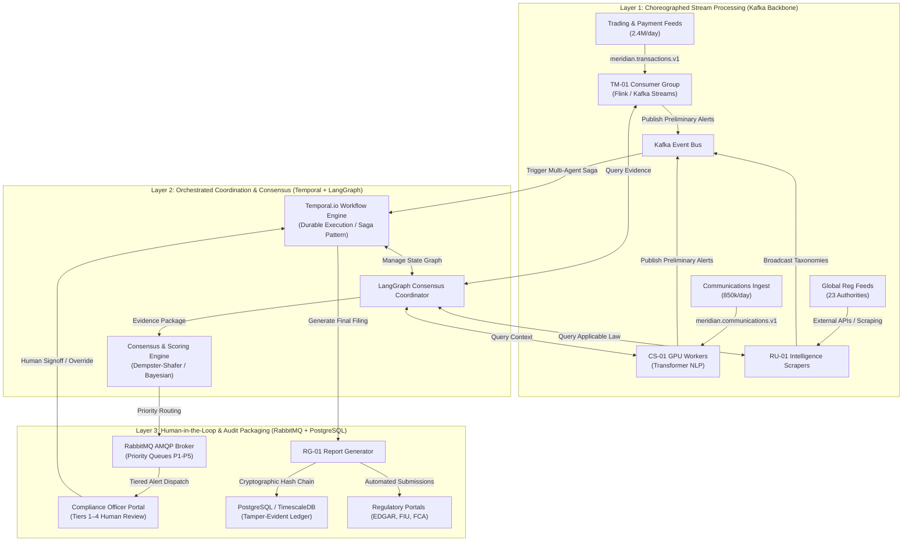
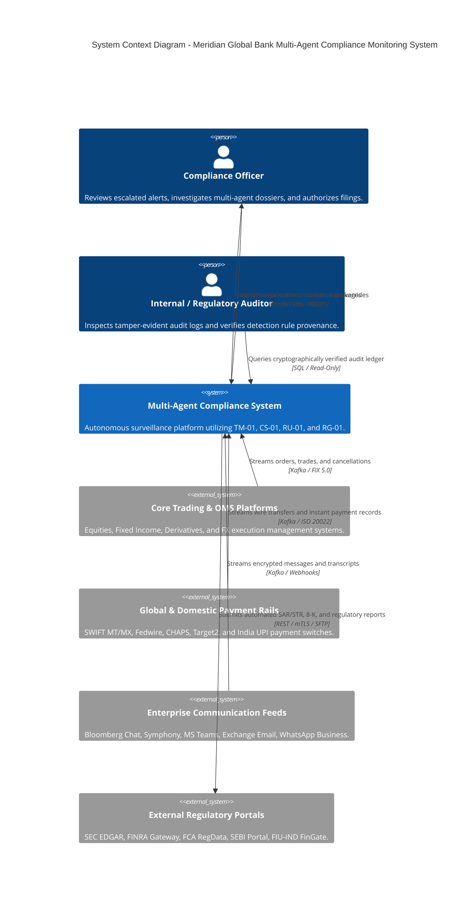
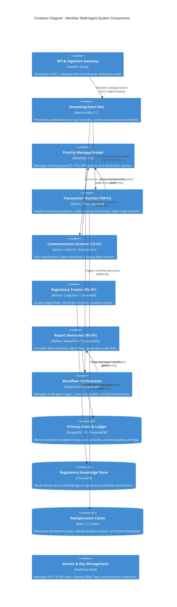
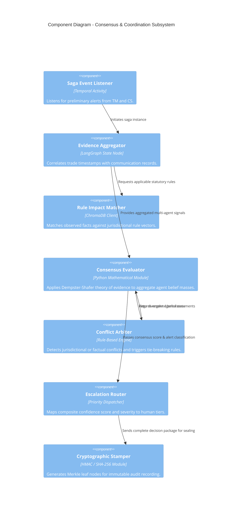
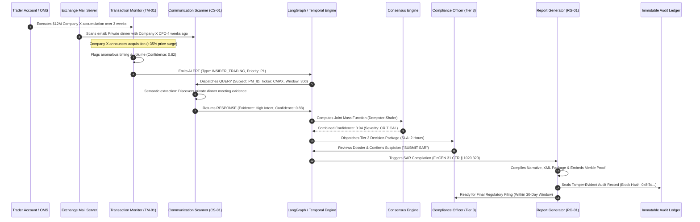

# Multi-Agent System Topology & C4 Architecture Specification
**System:** Meridian Global Bank Multi-Agent Compliance Monitoring System (Project 1B)  
**Document Code:** `D1-ST-v1.0`  
**Classification:** Tier-2 Global Banking System Architecture  
**Author:** AI Systems Architect, Zetheta Algorithms  

---

## 1. Architectural Topology Overview

The Meridian Global Bank compliance monitoring architecture implements a **Hybrid Hierarchical-Choreographed Agent Topology**.

Purely choreographic systems (pure event-driven without coordinators) suffer from untraceable cascading loops and lack deterministic global state, making them unsuitable for stringent banking audits. Conversely, purely centralized orchestrators create single points of failure (SPOF) and catastrophic throughput bottlenecks when processing 2.4 million daily transactions.

To achieve both high throughput and audit-grade determinism, Meridian deploys a **Two-Tier Hybrid Topology**:
1. **Tier 1 (Streaming Ingestion & Autonomous Detection — Choreographed):** Ingestion and preliminary pattern detection operate choreographically over **Apache Kafka**. `TM-01` and `CS-01` autonomously ingest high-velocity data, evaluate sliding windows, and publish preliminary alerts without blocking or querying a central master.
2. **Tier 2 (Multi-Agent Correlation, Consensus & Escalation — Orchestrated Saga):** Once a potential cross-domain violation or high-severity anomaly is identified, execution transitions to an orchestrated **Temporal.io & LangGraph** state machine. This coordinator manages stateful multi-agent evidence gathering, consensus scoring, human-in-the-loop escalation, and audit trail finalization.

---

## 2. Dual Message Broker Infrastructure: Kafka vs. RabbitMQ Rationale

A core architectural innovation of the Meridian platform is the deliberate separation of streaming throughput from transactional priority routing using a dual-broker strategy:

### 2.1 Apache Kafka: The High-Throughput Event Log
* **Role:** Ingestion backbone, event sourcing, continuous time-series streaming.
* **Volume Handled:** 2.4 million transactions/day (~30–50 events/sec average, 35,000 events/sec peak at market open) and 850,000 communications/day.
* **Key Capabilities Used:**
  * **Partitioned Topics:** Keyed partitioning by `account_id` and `instrument_id` guarantees in-order event delivery for strict temporal analysis (front-running, wash trading).
  * **Log Compaction & Replay:** Enables full event sourcing and retroactive compliance audits; if detection algorithms are updated by `RU-01`, transactions can be replayed from any historical offset.
  * **Zero-Copy Disk Persistence:** Guarantees zero data loss under high load.

### 2.2 RabbitMQ: Priority AMQP Routing & Dead-Letter Isolation
* **Role:** Targeted inter-agent Remote Procedure Calls (RPC), priority-based human escalation dispatch, and dead-letter queue (DLQ) containment.
* **Key Capabilities Used:**
  * **Priority Queuing (x-max-priority = 5):** Guarantees that CRITICAL (P1) alerts (e.g., active OFAC sanctions match or imminent $400M fraud) pre-empt lower priority batch notifications (P4/P5).
  * **Dead Letter Exchanges (DLX):** Unparseable payloads, malformed messages, or unacknowledged agent timeouts are automatically routed to `agent.deadletter.queue` with detailed diagnostic envelopes for quarantine.
  * **Transactional Acknowledgment (ACK/NACK):** Assures that no human compliance alert is lost during server restarts or network partitions.

---

## 3. C4 Model Architecture Specification

### 3.1 C4 Level 1: System Context Diagram
The System Context diagram details how the Multi-Agent Compliance Monitoring System sits within the enterprise ecosystem of Meridian Global Bank and interacts with internal trading infrastructure and external regulatory bodies.

---

### 3.2 C4 Level 2: Container Diagram
The Container diagram illustrates the high-level technical building blocks, operational containers, datastores, and networking protocols.

---

### 3.3 C4 Level 3: Component Diagram (Agent Coordination & Consensus Engine)
The Component diagram focuses on the internal structure of the Multi-Agent Orchestration & Consensus Subsystem.

---

### 3.4 C4 Level 4: Code & Execution Sequence Diagram
This execution sequence traces Scenario **CS-01** (Pre-Announcement Insider Trading Accumulation):

---

## 4. Architectural Trade-Off Analysis

| Architectural Pattern | Latency Profile | Fault Tolerance | Audit Determinism | Implementation Complexity | Decision for Meridian |
| :--- | :--- | :--- | :--- | :--- | :--- |
| **Pure Centralized Orchestration** | Poor (Single choke-point for 2.4M txns/day) | Low (Central coordinator crash halts all surveillance) | High (Single state machine controls all transitions) | Moderate | **Rejected:** Bottlenecks ingestion volume. |
| **Pure Event Choreography** | Excellent (<5ms peer-to-peer pub/sub) | High (Decoupled agents; no central failure node) | Very Poor (Difficult to reconstruct end-to-end multi-agent timeline) | High (Prone to circular cascades and race conditions) | **Rejected:** Fails regulatory examination standards. |
| **Two-Tier Hybrid Saga (Adopted)** | **Optimal:** Stream ingestion is asynchronous; escalation sagas are deterministic. | **High:** Kafka guarantees stream durability; Temporal provides durable workflow state recovery. | **Maximum:** Every saga step is recorded in an immutable event ledger. | High (Requires rigorous schema and state machine contracts) | **ACCEPTED:** Selected as the production standard for Meridian Global Bank. |
