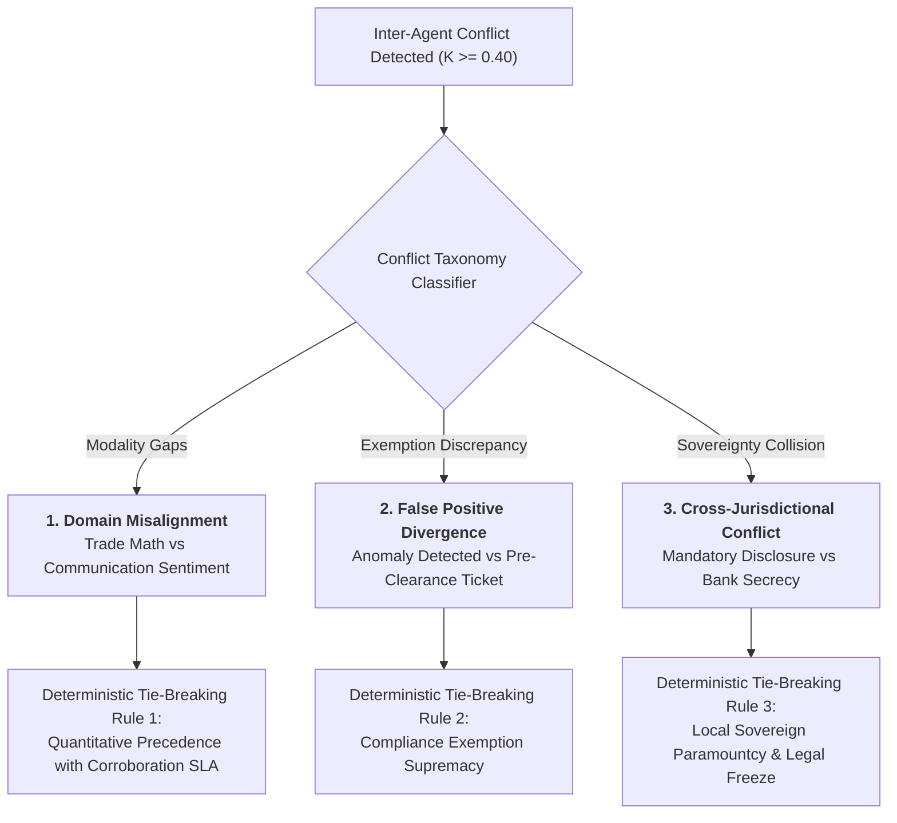

# Inter-Agent Conflict Taxonomy, Tie-Breaking Rules & Mediator Procedures
**System:** Meridian Global Bank Multi-Agent Compliance Monitoring System (Project 1B)  
**Document Code:** `D3-CT-v2.0`  
**Classification:** Tier-2 Global Banking Architecture Specification  
**Author:** AI Systems Architect, Zetheta Algorithms  

---

## 1. Conflict Classification Taxonomy

When independent agents observe complex banking activities, disagreements emerge from model differences, data modality gaps, and conflicting sovereign laws. The system standardizes three primary conflict taxonomies:



---

## 2. In-Depth Conflict Analysis & Deterministic Tie-Breaking Rules

### 2.1 Category 1: Domain Misalignment
* **Definition:** Disagreement arising when structured trading feeds (`TM-01`) indicate anomalous market execution, but unstructured communications (`CS-01`) show no conspiratorial language—or conversely, where aggressive talk occurs without corresponding trades.
* **Archetype Example (Spoofing vs Silent Chat):** An algorithmic trading desk places and cancels 47 crude oil futures orders within 300ms ($OTR = 35:1$). `CS-01` finds no chat chatter because the manipulation was fully automated.
* **Deterministic Tie-Breaking Rule:**
  * **Objective Quantitative Supremacy:** Algorithmic market manipulation violations under CEA Section 4c(a)(5) and Dodd-Frank Section 747 do **not** require proof of verbal collusion; the mathematical pattern of order cancellation establishes the prima facie violation.
  * `TM-01` quantitative evidence overrides `CS-01` silence.
  * Combined belief is set to $m(\{V\}) = \max(m_{\text{TM}}(\{V\}), \; 0.85)$.
  * A mandatory notice is appended to the Decision Support Package stating: *"Automated algorithm detected; lack of conversational corroboration expected."*

### 2.2 Category 2: False Positive Divergence
* **Definition:** An agent flags a severe statistical outlier, but another agent identifies an official regulatory exemption, pre-clearance ticket, or authorized corporate program.
* **Archetype Example (CS-18: Legitimate Block Trade):** `TM-01` flags a $450 million equity trade representing 8% of Average Daily Volume. `CS-01` and system ticket records confirm the trade was pre-arranged with the institutional block desk under an approved corporate rebalancing mandate.
* **Deterministic Tie-Breaking Rule:**
  * **Documented Compliance Exemption Supremacy:** Explicit statutory exemptions and verified pre-trade clearance tickets supersede statistical anomaly triggers.
  * If verified pre-clearance ticket ID exists and matches counterparty/amount within $\pm 0.1\%$, the alert is **definitively suppressed**.
  * The system enters an automated audit event (`SUPPRESSED_FALSE_POSITIVE`) with zero human alert paging, avoiding a $-25$ point penalty.

### 2.3 Category 3: Cross-Jurisdictional Regulatory Conflict
* **Definition:** Compliance with the statutory mandate of Jurisdiction $A$ constitutes a direct criminal or civil violation of the sovereign laws of Jurisdiction $B$.
* **Archetype Example (CS-19: EU EMIR vs Singapore MAS):**
  * EU EMIR mandates reporting all OTC derivative details to an approved trade repository within 1 business day ($T+1$).
  * Singapore MAS Banking Act (Cap. 19, Section 47) and personal data protection regulations prohibit cross-border disclosure of customer banking and position data without explicit customer consent or court order.
* **Deterministic Tie-Breaking Rule:**
  * **Strict Sovereign Data Paramountcy & Immediate Escrow:** The system is strictly prohibited from autonomously resolving sovereign conflicts.
  * Trade reporting to the extraterritorial regulator (EMIR) is halted and staged in an encrypted legal escrow holding queue.
  * The conflict is tagged as **Priority 1 CRITICAL** and escalated immediately to the **General Counsel and Chief Compliance Officer (Tier 4)** within **< 15 minutes**.

---

## 3. Mediator Fallback Procedures (High-Conflict Deadlocks)

When the conflict metric $K$ crosses critical boundaries, automated consensus halts to prevent Zadeh’s paradox distortions:

```
+---------------------------------------------------------------------------------------------------+
| CONFLICT RANGE (K) | OPERATIONAL STATUS       | MATHEMATICAL COMBINATION RULE     | SYSTEM ACTION |
+---------------------------------------------------------------------------------------------------+
| K < 0.65           | Normal Consensus         | Standard Dempster-Shafer Sum      | Auto-Resolved |
| 0.65 <= K < 0.85   | Elevated Conflict        | Yager's Modified Combination Rule | Tier 2 Review |
| K >= 0.85          | Severe Deadlock (Zadeh)  | Suspended Combination (Orthogonal)| Tier 3 Freeze |
+---------------------------------------------------------------------------------------------------+
```

### 3.1 Yager's Modified Combination Algorithm ($0.65 \le K < 0.85$)
Under Yager's rule, conflicting belief masses are not redistributed to focal elements by dividing by $1 - K$. Instead, the conflicting mass $K$ is assigned directly to the uncommitted ignorance set $\Theta$:

$$m_Y(A) = \sum_{B \cap C = A} m_1(B) \cdot m_2(C) \quad \forall A \subset \Theta, \; A \neq \emptyset$$

$$m_Y(\Theta) = m_1(\Theta) \cdot m_2(\Theta) + K$$

This preserves mathematical integrity by explicitly declaring that the agents' contradiction demonstrates a state of profound uncertainty rather than false certainty.

---

## 4. Conflict Audit Trail Logging Schema

Every identified conflict ($K \ge 0.40$) generates an immutable, tamper-evident log in TimescaleDB:

```json
{
  "conflict_event_id": "cnf-20261001-8841-a1b2",
  "timestamp": "2026-10-01T14:48:22.109Z",
  "conflict_taxonomy": "FALSE_POSITIVE_DIVERGENCE",
  "conflict_metric_k": 0.724,
  "participating_agents": ["TM-01", "CS-01"],
  "agent_evaluations": {
    "TM-01": {
      "assertion": "VIOLATION",
      "calibrated_confidence": 0.85,
      "mass_vector": { "V": 0.765, "not_V": 0.135, "Theta": 0.100 }
    },
    "CS-01": {
      "assertion": "BENIGN_EXEMPTION",
      "calibrated_confidence": 0.10,
      "mass_vector": { "V": 0.085, "not_V": 0.765, "Theta": 0.150 }
    }
  },
  "arbitration_rule_applied": "COMPLIANCE_EXEMPTION_SUPREMACY",
  "outcome": "ALERT_SUPPRESSED_CONFIRMED_BLOCK_TRADE",
  "human_intervention_required": false,
  "cryptographic_proof": "sha256:7f92a1...04c8"
}
```
