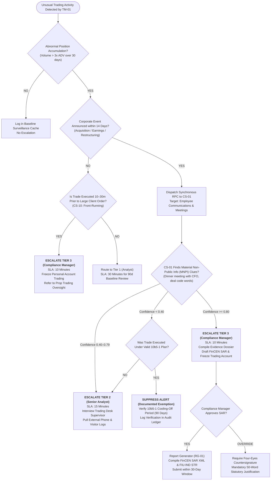

# Escalation Decision Tree: Insider Trading Surveillance
**System:** Meridian Global Bank Multi-Agent Compliance Monitoring System (Project 1B)  
**Workflow Code:** `DT-IT-v1.0`  
**Target Scenarios:** CS-01, CS-10, CS-16  
**Governing Regulations:** SEC Rule 10b-5, FINRA Rules 2010/5270, Insider Trading Sanctions Act (ITSA), SEBI PIT Regulations  

---

## 1. Insider Trading Workflow Decision Tree

---

## 2. Quantitative Thresholds & Decision Criteria
1. **Abnormal Volume Surge:** Cumulative position buildup exceeds $300\%$ of the account's historical 90-day moving average.
2. **Abnormal Return Trigger:** Price appreciation exceeding $\ge 15\%$ within 72 hours of public announcement.
3. **Communication Corroboration:** Semantic NLP intent score $\ge 0.75$ on private meetings, informal dinners, or non-public earnings previews.
4. **Action Protocols:** Mandatory freeze of personal trading accounts upon Tier 3 confirmation; SAR narrative compilation triggered automatically.
