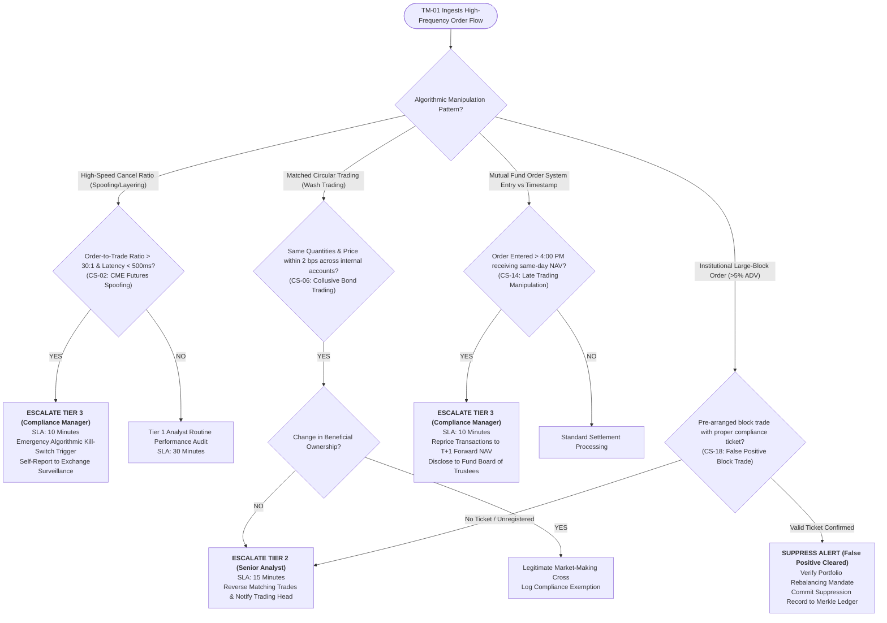

# Escalation Decision Tree: Market Manipulation & Algorithmic Surveillance
**System:** Meridian Global Bank Multi-Agent Compliance Monitoring System (Project 1B)  
**Workflow Code:** `DT-MM-v1.0`  
**Target Scenarios:** CS-02, CS-06, CS-14, CS-15, CS-18  
**Governing Regulations:** Dodd-Frank Section 747, CEA Section 4c(a)(5), CME Rule 575, SEC Rules 10b-5 / 22c-1, FINRA Rules 5210 / 5310  

---

## 1. Market Abuse & Manipulation Decision Tree

---

## 2. Quantitative Thresholds for Automated Interventions
1. **Algorithmic Kill-Switch Trigger:** If a single algorithmic trading strategy produces $> 40$ cancellation events within $< 500\text{ ms}$ on opposite sides of the order book without execution, the system issues an automated temporary FIX session suspension pending Tier 3 compliance review.
2. **Wash Sale Matching Criteria:** Matched executions where Buyer Account and Seller Account share common ultimate beneficial owners (UBO) or identical trading desk management, with trade times differing by $< 3\text{ seconds}$ and prices within $\le 2\text{ basis points}$.
3. **Late Trading Forward-Pricing Validation:** Comparing network gateway packet arrival timestamps against internal OMS database commit timestamps under Rule 22c-1.
