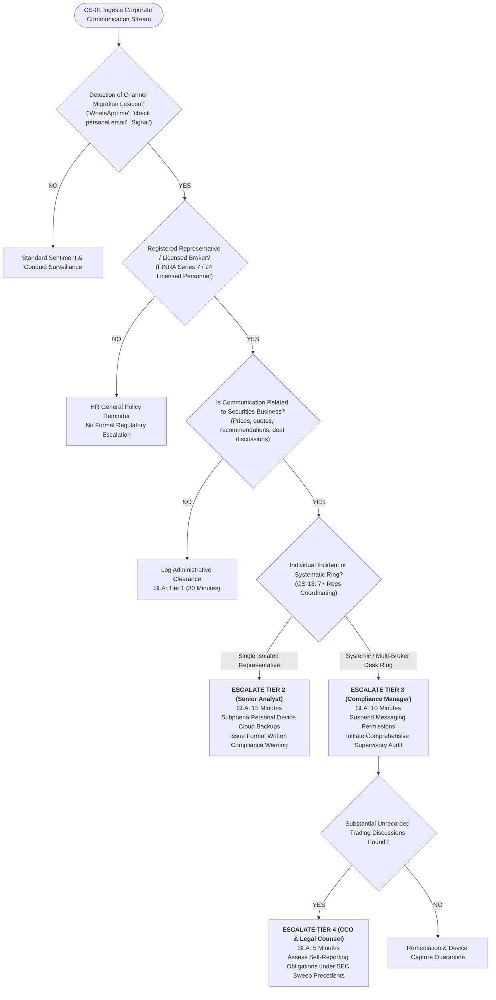

# Escalation Decision Tree: Off-Channel Communications & Recordkeeping
**System:** Meridian Global Bank Multi-Agent Compliance Monitoring System (Project 1B)  
**Workflow Code:** `DT-OC-v1.0`  
**Target Scenarios:** CS-05, CS-08, CS-13  
**Governing Regulations:** SEC Rule 17a-4, Exchange Act Section 17(a), FINRA Rules 2210/3110, FCA SYSC 9  

---

## 1. Off-Channel Surveillance Workflow

---

## 2. Detection Patterns & Remediation Standards
* **Evasion Patterns:** Detecting disguised phone numbers (e.g., spelled out digits "nine-one-seven...", QR codes shared via image attachments, links to ephemeral messaging apps).
* **Supervisory Enforcement:** In alignment with SEC and CFTC enforcement actions against major broker-dealers for WhatsApp recordkeeping failures, systematic unapproved messaging triggers immediate supervisory remediation, hardware confiscation for forensic imaging, and employee conduct recordation.
