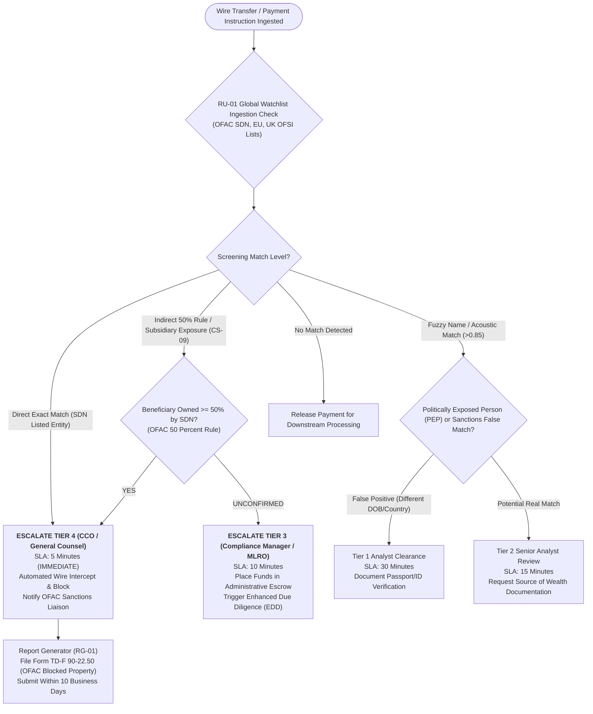

# Escalation Decision Tree: Sanctions Violations & Counterparty Screening
**System:** Meridian Global Bank Multi-Agent Compliance Monitoring System (Project 1B)  
**Workflow Code:** `DT-SV-v1.0`  
**Target Scenarios:** CS-09, CS-20  
**Governing Regulations:** OFAC Regulations (31 CFR Part 501), EU Financial Sanctions, UK OFSI Directives, UN Security Council Resolutions  

---

## 1. Sanctions Screening & Escalation Workflow

---

## 2. Hard Execution Mandates
* **Zero-Tolerance Wire Intercept:** Any direct OFAC SDN hit results in an automated microsecond wire hold prior to execution across SWIFT or Fedwire rails.
* **OFAC 50% Rule Evaluation:** `RU-01` corporate hierarchy graph recursively traverses subsidiary ownership stakes up to 4 corporate parent tiers to flag indirect ownership exposure exceeding statutory thresholds.
* **Reporting SLA:** Official OFAC Report of Blocked Property must be generated and filed by `RG-01` within **10 business days** under 31 CFR § 501.603.
