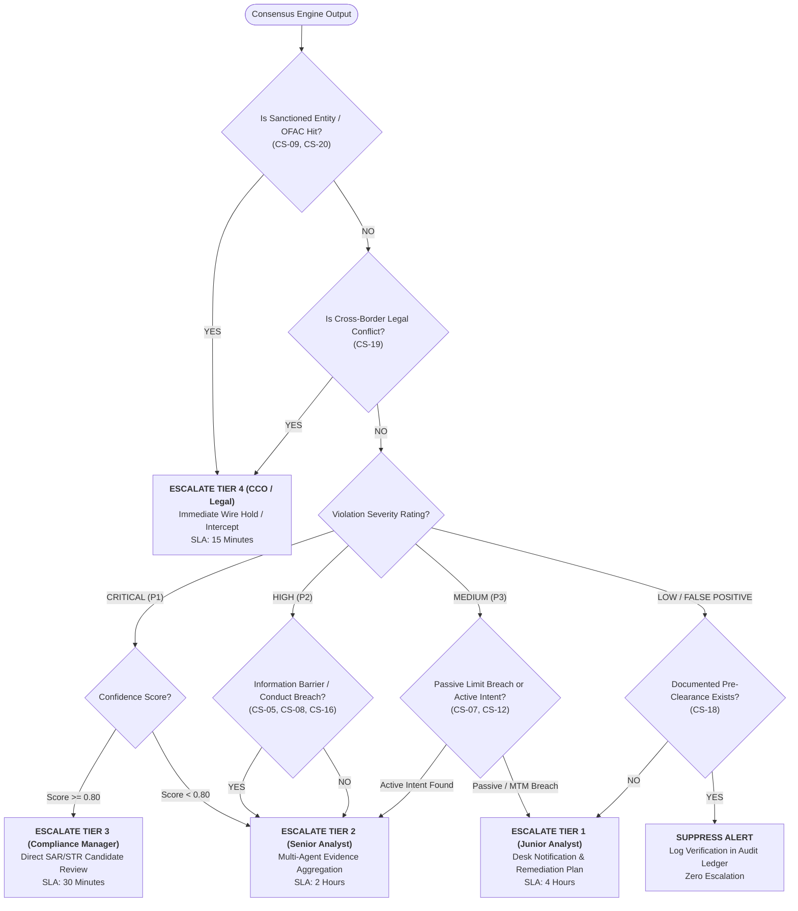
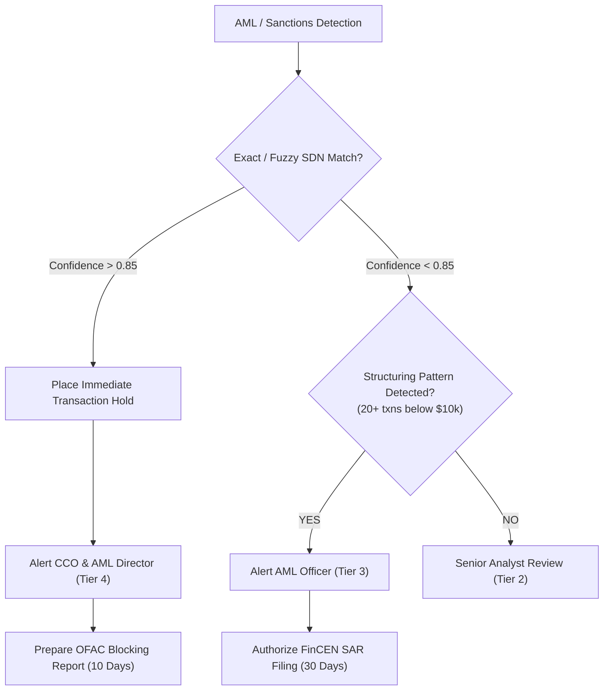
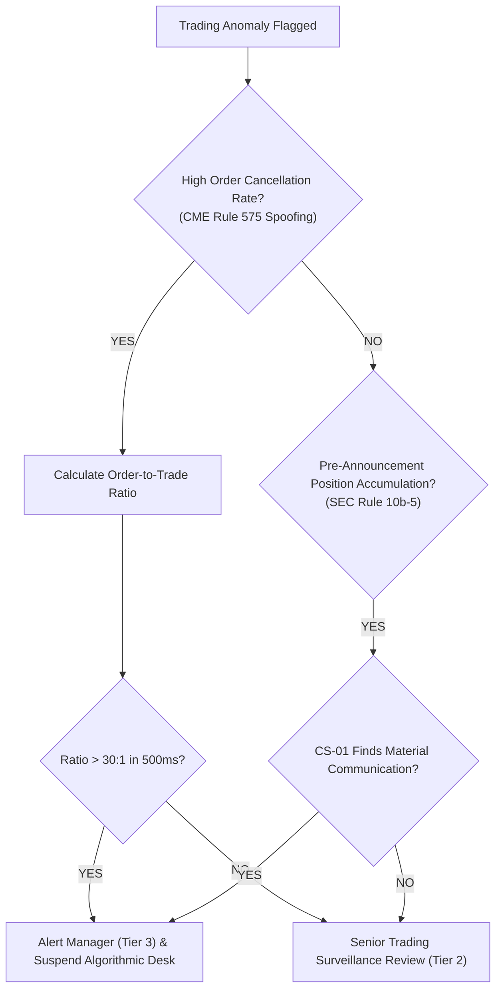

# Escalation Decision Trees & Routing Logic
**System:** Meridian Global Bank Multi-Agent Compliance Monitoring System (Project 1B)  
**Document Code:** `D4-DT-v1.0`  
**Classification:** Tier-2 Global Banking Architecture Specification  
**Author:** AI Systems Architect, Zetheta Algorithms  

---

## 1. Primary Escalation Decision Tree

This master decision tree governs how composite signals from the Consensus Engine are routed across human compliance tiers.

---

## 2. Domain-Specific Escalation Subtrees

### 2.1 Sanctions & Anti-Money Laundering Subtree (CS-04, CS-09, CS-20)

### 2.2 Market Abuse & Trading Conduct Subtree (CS-01, CS-02, CS-06, CS-10)

