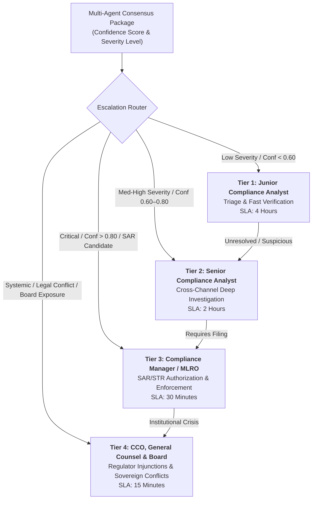

# Human-in-the-Loop Escalation Framework
**System:** Meridian Global Bank Multi-Agent Compliance Monitoring System (Project 1B)  
**Document Code:** `D4-EF-v1.0`  
**Classification:** Tier-2 Global Banking Architecture Specification  
**Author:** AI Systems Architect, Zetheta Algorithms  

---

## 1. Four-Tier Human Escalation Hierarchy

Autonomous AI agents do not possess legal authority to submit statutory disclosures or freeze institutional banking accounts independently. The Meridian system enforces an automated **Human-in-the-Loop (HITL)** escalation matrix mapping machine confidence and risk severity to specialized compliance officers.

---

## 2. Tier Roles, Mandates & SLA Matrix

| Escalation Tier | Assigned Personnel | Typical Incident Scope | Review SLA | Authority & Action Mandate |
| :---: | :--- | :--- | :---: | :--- |
| **Tier 1** | Junior Compliance Analyst | Low-risk threshold alerts, routine prospectus limit deviations (CS-12), initial triage | **< 4 Hours** | Can clear documented false positives or escalate to Tier 2. Cannot dismiss high-risk flags. |
| **Tier 2** | Senior Compliance Analyst | Wash trading investigations (CS-06), suitability breaches (CS-03), off-channel communication tracking (CS-13) | **< 2 Hours** | Can interview trading desk, request extended transaction logs, assemble formal investigation dossier. |
| **Tier 3** | Compliance Manager / MLRO | Insider trading (CS-01), currency structuring (CS-04), elder financial exploitation (CS-17), Chinese Wall breaches (CS-05) | **< 30 Mins** | Authorized to endorse and sign SAR/STR filings, initiate internal HR conduct reviews, freeze accounts. |
| **Tier 4** | Chief Compliance Officer (CCO) & General Counsel | OFAC Sanctions matches (CS-09), cross-border sovereign legal conflicts (CS-19), coordinated trade finance money laundering (CS-20) | **< 15 Mins** | Direct engagement with regulatory boards (SEC, FCA, RBI), board risk notifications, immediate wire blocks. |

---

## 3. Decision Support Package (DSP) Standard

When an escalation is delivered to a human officer, the system compiles a standardized **Decision Support Package** comprising:

1. **Executive Incident Summary:** Plain-English description of the alleged violation, affected accounts, traders, instruments, and financial magnitude.
2. **Multi-Agent Evidence Dossier:**
   * Structured trade sequence table with timestamp, quantity, price, and venue (`TM-01`).
   * Highlighting of communication excerpts, intent scores, and sentiment markers (`CS-01`).
   * Relevant statutory sections and precedent enforcement citations (`RU-01`).
3. **Consensus Confidence Matrix:** Mathematical belief distribution, conflict metric ($K$), and breakdown of agent mass functions.
4. **Actionable Recommendations:** Pre-compiled options (e.g., `[APPROVE_AND_FILE_SAR]`, `[DISMISS_AS_LEGITIMATE]`, `[REQUEST_DESK_INTERVIEW]`).
5. **Statutory Filing Countdown:** Prominent countdown timer showing remaining hours before statutory deadlines expire (e.g., GDPR 72-hour clock, FinCEN 30-day SAR clock).

---

## 4. Human Override Protocol & Governance

Human compliance officers maintain the absolute authority to override agent recommendations, subject to strict governance:
* **Mandatory Written Justification:** Any analyst or manager overriding an agent's `CRITICAL` alert must enter a minimum 50-word statutory rationale detailing why the activity was determined benign.
* **Cryptographic Sealing:** The override decision, reviewer identity, timestamp, and rationale are digitally signed and committed to the immutable audit ledger.
* **Secondary Concurrence (Four-Eyes Principle):** Overriding an agent recommendation on a `CRITICAL` alert requires independent signoff by a second officer of equal or higher tier.
* **Model Retraining Feedback Loop:** Confirmed overrides are tagged and ingested into the offline model evaluation pipeline to refine false-positive suppression rules.
