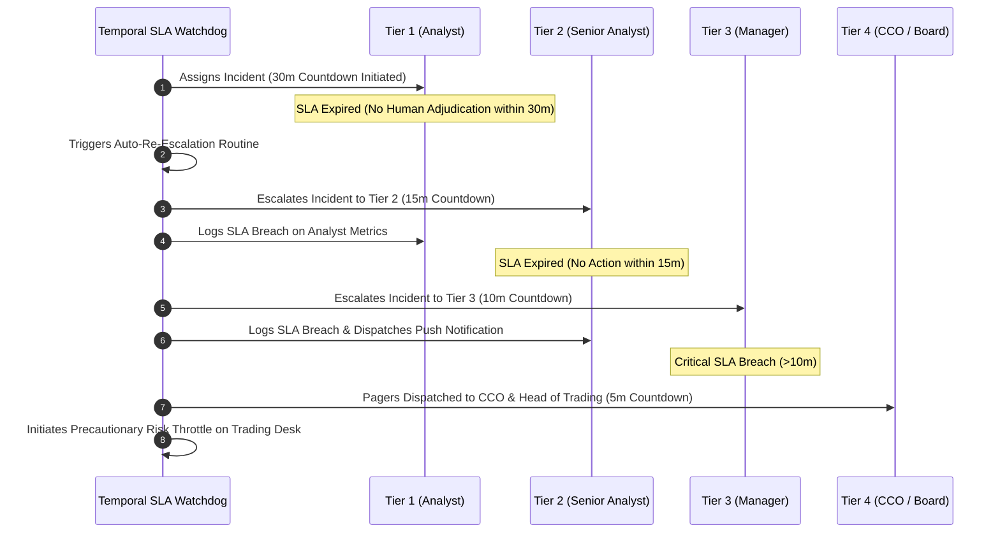

# Human-in-the-Loop Escalation Framework & SLA Protocol
**System:** Meridian Global Bank Multi-Agent Compliance Monitoring System (Project 1B)  
**Document Code:** `D4-EF-v2.0`  
**Classification:** Tier-2 Global Banking Architecture Specification  
**Author:** AI Systems Architect, Zetheta Algorithms  

---

## 1. Four-Tier Human Escalation Hierarchy & Tight SLAs

To ensure rapid response to live market abuse and financial crime, Meridian enforces a strict 4-Tier Escalation Hierarchy with automated SLA countdown timers:

```
+---------------------------------------------------------------------------------------------------+
| TIER   | ROLE / ASSIGNED PERSONNEL          | HARD REVIEW SLA | PRIMARY SCOPE & ESCALATION TRIGGER|
+---------------------------------------------------------------------------------------------------+
| Tier 1 | Compliance Analyst                 | < 30 Minutes    | Low/Medium alerts, limit breaches |
| Tier 2 | Senior Compliance Analyst          | < 15 Minutes    | Cross-channel conduct, suitability|
| Tier 3 | Compliance Manager / MLRO          | < 10 Minutes    | High-confidence SAR/STR candidates|
| Tier 4 | CCO / Board Risk Committee / GC    | < 5 Minutes     | OFAC matches, sovereign conflicts |
+---------------------------------------------------------------------------------------------------+
```

```mermaid
graph TD
    Incident["Multi-Agent Consensus Incident Package"] --> Classifier{"SLA & Severity Classifier"}

    Classifier -->|Severity: LOW / Confidence < 0.60| T1["<b>Tier 1: Compliance Analyst</b><br/>SLA: 30 Minutes<br/>Initial Triage & Limit Remediation"]
    Classifier -->|Severity: HIGH / Multi-Channel| T2["<b>Tier 2: Senior Compliance Analyst</b><br/>SLA: 15 Minutes<br/>Complex Evidence Aggregation & Interviews"]
    Classifier -->|Severity: CRITICAL / SAR Trigger| T3["<b>Tier 3: Compliance Manager / MLRO</b><br/>SLA: 10 Minutes<br/>SAR/STR Authorization & Account Restraint"]
    Classifier -->|Sanctions / Extraterritorial / Crisis| T4["<b>Tier 4: CCO / Board Risk / GC</b><br/>SLA: 5 Minutes (Immediate)<br/>Sovereign Conflict & Regulatory Disclosure"]

    T1 -->|Missed SLA (>30m) or Complex| T2
    T2 -->|Missed SLA (>15m) or Severe| T3
    T3 -->|Missed SLA (>10m) or Systemic| T4
```

---

## 2. Precise Escalation Triggers by Tier

### 2.1 Tier 1: Compliance Analyst (SLA < 30 Minutes)
* **Trigger 1 (Passive Portfolio Limit Breach):** Fund sector concentration exceeding prospectus limits by $< 3\%$ due to mark-to-market price appreciation without active purchase intent (CS-12).
* **Trigger 2 (Regulatory Update Operational Assessment):** SEC or Basel III margin formula updates requiring technical policy delta evaluation within 120 days (CS-07).
* **Trigger 3 (Routine Inquiries):** Ambiguous marketing text requiring minor copy clarification without public distribution (low-reach draft).

### 2.2 Tier 2: Senior Compliance Analyst (SLA < 15 Minutes)
* **Trigger 1 (Suitability Mismatch):** Advisor recommending high-risk speculative instruments to elderly/retirement clients where IPS prohibits speculation (CS-03).
* **Trigger 2 (Wash Trading Correlation):** Circular matching trades between internal accounts within 2 bps price variance over 14 days (CS-06).
* **Trigger 3 (Off-Channel Communication Detection):** Systemic use of unmonitored personal messaging platforms (WhatsApp/Signal) for securities business (CS-13).
* **Trigger 4 (Best Execution Execution Quality Failure):** Systematic order routing bias favoring payment-for-order-flow venues with inferior execution prices (CS-15).

### 2.3 Tier 3: Compliance Manager / MLRO (SLA < 10 Minutes)
* **Trigger 1 (Pre-Announcement Insider Trading):** Executive position accumulation preceding major corporate acquisition by $< 3$ weeks with communication meeting traces (CS-01).
* **Trigger 2 (Currency Structuring / Smurfing):** 20+ cash deposits under $10,000 across multiple branch locations within 10 business days (CS-04).
* **Trigger 3 (Information Barrier Breach):** M&A private-side bankers communicating non-public deal information to public equity research (CS-05).
* **Trigger 4 (Elder Financial Exploitation):** Rapid acceleration of trading volume under newly executed Power of Attorney resulting in sharp portfolio losses (CS-17).
* **Trigger 5 (Mutual Fund Late Trading):** Orders timestamped 4:00 PM entered at 4:15 PM receiving same-day NAV pricing (CS-14).

### 2.4 Tier 4: Chief Compliance Officer, General Counsel & Board (SLA < 5 Minutes / Immediate)
* **Trigger 1 (Direct or Indirect OFAC Sanctions Match):** Real-time wire transfer beneficiary matching an OFAC Specially Designated National (SDN) or high-risk subsidiary (CS-09).
* **Trigger 2 (Cross-Border Sovereign Conflict):** Direct legal contradiction between extraterritorial reporting mandates (EU EMIR) and national bank secrecy/data privacy laws (Singapore MAS / India RBI) (CS-19).
* **Trigger 3 (Trade-Based Money Laundering & Executive Misconduct):** Fictitious high-value trade finance transactions with relationship manager compliance overrides (CS-20).

---

## 3. Decision Support Package (DSP) Standard

When an incident escalates to any human tier, the system automatically compiles and renders an immutable **Decision Support Package (DSP)**:

```
+===================================================================================================+
| MERIDIAN GLOBAL BANK - DECISION SUPPORT PACKAGE (DSP-V2)                                          |
+===================================================================================================+
| Incident ID: INC-20261001-9012-A1       | Priority: P1 CRITICAL      | SLA Remaining: 09m:42s      |
| Entity: John Doe (Trader ID: TRD-4410)  | Desk: Crude Oil Prop Desk  | Jurisdiction: US (CFTC/SEC) |
+---------------------------------------------------------------------------------------------------+
| 1. EXECUTIVE INCIDENT SUMMARY                                                                     |
|    Algorithmic spoofing detected in CME Crude Oil Futures (CL_FUT_2026). Desk entered 47 large    |
|    limit orders on Bid side, cancelled within 240ms, executing matching sell orders on Ask side.  |
|    Estimated illicit market impact: $1.42M. Violation of CEA Section 4c(a)(5) & CME Rule 575.     |
+---------------------------------------------------------------------------------------------------+
| 2. MULTI-AGENT OBSERVATIONAL EVIDENCE TRACE                                                       |
|    - TM-01 Trace: OTR = 35.2:1 (Threshold: >30:1). Cancellation latency mean = 248ms.             |
|    - CS-01 Trace: Scanned 14 chat messages across Bloomberg; zero verbal collusion detected.       |
|    - RU-01 Trace: CME Rule 575 & CFTC v. Navinder Sarao precedent cited. Strict liability.        |
|    - Consensus Engine: Dempster-Shafer Bel(V) = 0.88, Conflict K = 0.18 (Consensus Confirmed).   |
+---------------------------------------------------------------------------------------------------+
| 3. STATUTORY FILINGS & REGULATORY DEADLINES                                                       |
|    - Statutory Filing Mandate: CFTC / CME Self-Report within 24 hours.                             |
|    - FinCEN SAR Filing: 30 Calendar Days (Clock expires: 2026-10-31 23:59 UTC).                    |
+---------------------------------------------------------------------------------------------------+
| 4. RECOMMENDED ADJUDICATION ACTIONS (ACTIONABLE BUTTONS)                                          |
|    [A] SUSPEND DESK ALGORITHMS & FREEZE TRADING PERMISSIONS (RECOMMENDED)                         |
|    [B] REQUEST IMMEDIATE IN-PERSON DESK SUPERVISOR INTERVIEW                                      |
|    [C] OVERRIDE ALERT (REQUIRES 50-WORD STATUTORY RATIONALE & FOUR-EYES COUNTERSIGNATURE)          |
+===================================================================================================+
```

---

## 4. Automated Re-Escalation Protocol for Missed SLAs

Every incident has a dedicated distributed countdown timer managed by Temporal.io:



* **Penalty Tracking:** Any missed SLA automatically docks 5 performance points from the supervisor's operational scorecard and is reported in the quarterly Board Audit telemetry report.
* **Precautionary Trading Throttle:** If a Priority 1 alert misses its Tier 3 SLA (>10m without action), the system automatically restricts the target desk's maximum order size to prevent catastrophic ongoing exposure.
