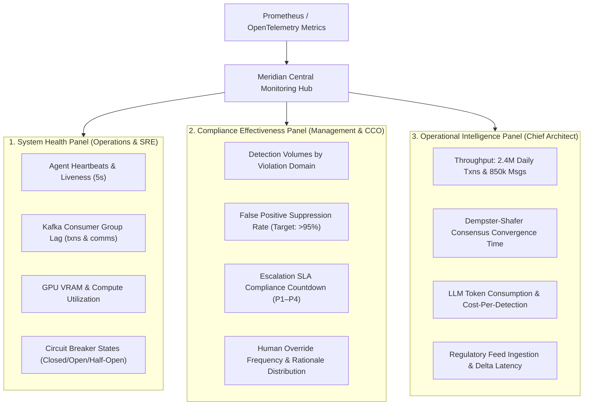

# Monitoring Dashboard Architecture & Telemetry Specification
**System:** Meridian Global Bank Multi-Agent Compliance Monitoring System (Project 1B)  
**Document Code:** `D7-MD-v1.0`  
**Classification:** Tier-2 Global Banking Architecture  

---

## 1. Dashboard Architecture Overview

The surveillance platform surfaces real-time metrics across three dedicated Grafana / React panels, tailored to specific organizational stakeholders:

---

## 2. Panel Specifications & Metric Definitions

### 2.1 Panel 1: System Health Panel (Target: Operations Team)
* **`agent_heartbeat_status` (Gauge):** Liveness boolean per agent instance (`TM-01`, `CS-01`, `RU-01`, `RG-01`). Alerts if heartbeat is missing for >15 seconds.
* **`kafka_consumer_lag_records` (Gauge):** Count of unconsumed messages per partition. Critical alert if lag on `meridian.transactions.v1` exceeds 10,000 records.
* **`gpu_memory_utilization_percent` (Gauge):** Tracks VRAM on NVIDIA L40S pods hosting `CS-01` transformers. Warning threshold at 80%; autoscaling trigger at 85%.
* **`circuit_breaker_state` (Enum):** Exposes current state (`0=Closed`, `1=Half-Open`, `2=Open`) across all external scrapers and LLM inference endpoints.

### 2.2 Panel 2: Compliance Effectiveness Panel (Target: Compliance Officers & CCO)
* **`violations_detected_total` (Counter):** Real-time counter segmented by compliance category (Insider Trading, Spoofing, Wash Trading, Structuring, Conduct Risk).
* **`false_positive_suppression_ratio` (Gauge):** Percentage of anomalous patterns autonomously verified and suppressed (e.g., CS-18 block trades). Target: $\ge 92\%$.
* **`escalation_sla_breach_timer_seconds` (Gauge):** Active countdown per open incident. Triggers visual and SMS alerts when remaining SLA drops under 25%.
* **`human_override_rate` (Gauge):** Ratio of human supervisor reversals to automated recommendations. Target: $< 5\%$.

### 2.3 Panel 3: Operational Intelligence Panel (Target: Systems Architects)
* **`surveillance_ingest_rate_eps` (Gauge):** Real-time events-per-second processed across all transaction and communication feeds.
* **`consensus_evaluation_duration_ms` (Histogram):** Latency distribution for Dempster-Shafer orthogonal sum computations. Target: 99th percentile $< 50\text{ ms}$.
* **`inference_token_cost_usd` (Counter):** Daily cumulative LLM API expenditure and local cluster power utilization.
