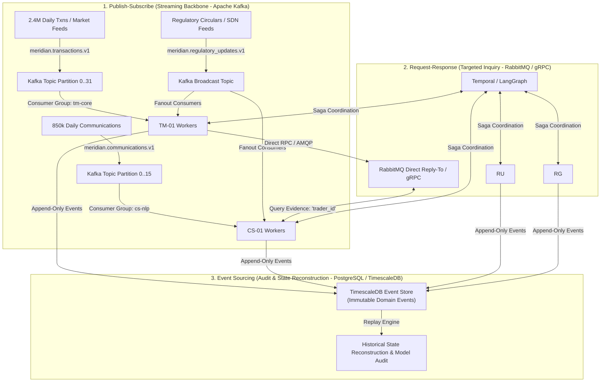
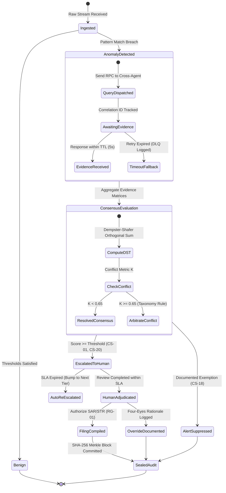

# Inter-Agent Communication Protocol Specification
**System:** Meridian Global Bank Multi-Agent Compliance Monitoring System (Project 1B)  
**Document Code:** `D2-CP-v2.0`  
**Classification:** Tier-2 Global Banking Architecture Specification  
**Author:** AI Systems Architect, Zetheta Algorithms  

---

## 1. Architectural Routing Paradigms

The Meridian Multi-Agent Compliance Monitoring System implements three distinct messaging patterns tailored to throughput, latency, and audit requirements across `TM-01`, `CS-01`, `RU-01`, `RG-01`, and coordination orchestrators.



---

## 2. Deep Dive: Architectural Routing Patterns

### 2.1 Pattern 1: Publish-Subscribe via Apache Kafka
* **Use Case:** High-throughput data ingestion, telemetry broadcasts, and decoupling producers from consumers.
* **Volume Handled:** 2.4 million transactions/day (average 28 events/sec, peak burst 35,000 events/sec) and 850,000 communications/day.
* **Topic Architecture & Partitioning:**
  * `meridian.transactions.v1`: 32 partitions keyed by `account_id` (secondary key `instrument_symbol`). Guarantees strict chronological ordering per account to accurately detect front-running and wash trading.
  * `meridian.communications.v1`: 16 partitions keyed by `employee_id`. Ensures multi-turn conversation traces remain on the same GPU worker node for cache locality.
  * `meridian.regulatory_updates.v1`: Broadcast topic (fanout) ingested simultaneously by all active agent instances.
* **Delivery Guarantees:** At-least-once delivery (`acks=all`, `min.insync.replicas=2`), combined with consumer-side idempotency tracking in Redis.

### 2.2 Pattern 2: Request-Response via gRPC / RabbitMQ Direct Reply-To
* **Use Case:** Low-latency, point-to-point cross-agent evidence queries during an active investigation.
* **Mechanism:**
  * When `TM-01` detects an abnormal trading burst in Company X shares (e.g., CS-01), it initiates an AMQP Direct Reply-To RPC call or unary gRPC call to `CS-01`.
  * `CS-01` receives the request with a dedicated correlation token (`correlation_id`), scans the trader's email and Bloomberg Chat history over the target 30-day window, and returns an evidence package within **< 500 milliseconds**.
  * Eliminates pub/sub polling delays for synchronous multi-agent consensus workflows.

### 2.3 Pattern 3: Event Sourcing & Historical State Reconstruction
* **Use Case:** Compliance auditability, model governance, and regulatory examinations.
* **Mechanism:**
  * Rather than storing only current state balances, every agent decision, belief score adjustment, and message envelope is stored as an immutable event in the TimescaleDB hypertable `compliance_events`.
  * **Time-Travel Audit:** Regulators or internal auditors can rewind the event log to any historical timestamp (e.g., 14:22:10 UTC on trade date $T$) and re-run agent algorithms with historical models to prove why an alert was triggered or suppressed.

---

## 3. Serialization Protocol: Protobuf v3 vs. Canonical JSON

To balance raw transport efficiency against legal audit readability, Meridian utilizes a dual-serialization format:

```
+---------------------------------------------------------------------------------------------------+
| DIMENSION             | PROTOCOL BUFFERS (PROTOBUF V3)     | CANONICAL JSON (DRAFT 2020-12)       |
+---------------------------------------------------------------------------------------------------+
| Primary Role          | Internal Streaming & Agent-to-Agent| Escalation Packages & Audit Ledger   |
| Wire Format           | Compact Binary                     | Plain Text (UTF-8)                   |
| Serialization Speed   | ~12x faster than JSON              | Moderate                             |
| Payload Size          | ~70% smaller (average 380 bytes)   | ~1.2 KB to 18 KB                     |
| Schema Evolution      | Strict field numbers & deprecation | Dynamic validation via JSON Schema   |
| Human Readability     | None (requires schema compilation) | Direct (audit-ready, court admissible)|
+---------------------------------------------------------------------------------------------------+
```

---

## 4. End-to-End Conversational Lifecycle State Machine

Every inter-agent investigation progresses through a formal distributed state machine managed by the **Temporal.io** saga coordinator:


