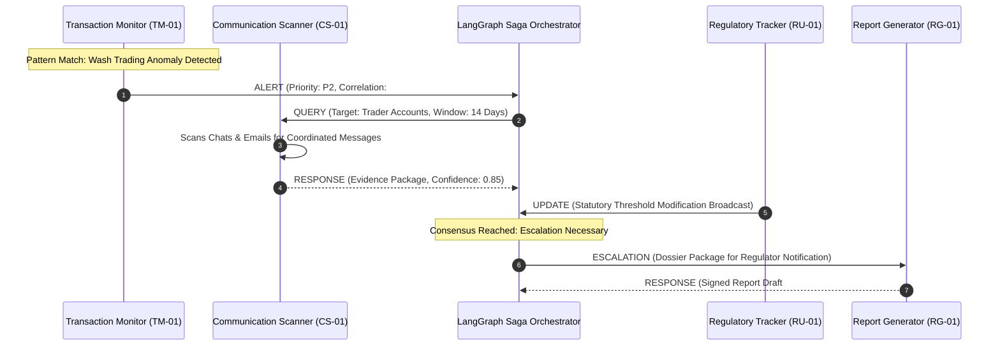

# Inter-Agent Communication Protocol Specification
**System:** Meridian Global Bank Multi-Agent Compliance Monitoring System (Project 1B)  
**Document Code:** `D2-CP-v1.0`  
**Classification:** Tier-2 Global Banking Architecture Specification  
**Author:** AI Systems Architect, Zetheta Algorithms  

---

## 1. Protocol Architecture & Interaction Patterns

The Meridian Inter-Agent Communication Protocol governs all machine-to-machine dialogues between the four core autonomous agents (`TM-01`, `CS-01`, `RU-01`, `RG-01`) and the central orchestration engine.

### 1.1 Core Interaction Archetypes



---

## 2. Standardized Message Types

The protocol standardizes six distinct message types:

1. **`ALERT` (Unsolicited Anomaly Notification):**
   * Emitted autonomously by detection agents (`TM-01`, `CS-01`) when incoming transaction or communication streams violate baseline statistical thresholds.
   * Carries preliminary confidence scores and pointers to raw streaming offsets.
2. **`QUERY` (Targeted Information Request):**
   * Synchronous or asynchronous request for secondary evidence.
   * Example: `TM-01` requesting `CS-01` to pull all private messages between Trader A and Trader B over a 48-hour trading window.
3. **`RESPONSE` (Evidence Delivery):**
   * Structured reply to a `QUERY`. Must reference the originating `correlation_id`.
   * Delivers tokenized evidence excerpts, NLP sentiment vectors, or regulatory interpretations.
4. **`UPDATE` (Broadcast Configuration / Rule Delta):**
   * Emitted primarily by `RU-01` to update internal agent states when global regulators publish circulars, adjust margin requirements, or update sanctions lists.
5. **`HEARTBEAT` (Liveness & Telemetry Ping):**
   * Transmitted every **5 seconds** by each agent to Redis/Consul to report health, memory utilization, GPU temperature, and Kafka consumer lag.
6. **`ESCALATION` (Human-in-the-Loop Dispatch):**
   * Dispatched by the consensus engine to the Compliance Review Board when automated confidence scores cross human intervention thresholds.

---

## 3. Envelope Specification & Cryptographic Verification

Every message exchanged across the transport layer adheres to a rigid three-part structure:

```
+------------------------------------------------------------------------------------+
| 1. ENVELOPE METADATA (Routing & Observability)                                     |
|    message_id, protocol_version, timestamp, priority, correlation_id, trace_id    |
+------------------------------------------------------------------------------------+
| 2. AUTHENTICATION & INTEGRITY (Zero-Trust Security)                               |
|    sender_agent_id, recipient_agent_id, sender_signature, nonce, audit_class       |
+------------------------------------------------------------------------------------+
| 3. PAYLOAD DATA (Domain Content)                                                   |
|    payload_schema, payload, confidence_score, ttl_seconds, retry_count             |
+------------------------------------------------------------------------------------+
```

### 3.1 Digital Signature Verification Pipeline
1. Originating agent generates the SHA-256 hash of `canonical_json(payload)`.
2. Signs the digest using the agent's private ECDSA P-384 key stored in HashiCorp Vault.
3. Receiver verifies the signature using the sender's public key fetched from the SPIFFE certificate bundle.
4. If signature validation fails or `nonce` already exists in Redis, the message is quarantined to the Dead-Letter Queue immediately.

---

## 4. Protocol Versioning & Backward Compatibility

* **Semantic Versioning:** Protocol envelopes declare `protocol_version` (currently `1.0.0`).
* **Additive Changes:** Minor releases (`1.x.0`) allow non-breaking additive fields. Consumers must ignore unknown fields without throwing parse exceptions.
* **Breaking Changes:** Major releases (`2.0.0`) trigger parallel endpoint routing through the API Gateway, maintaining backward compatibility for at least 90 days.
