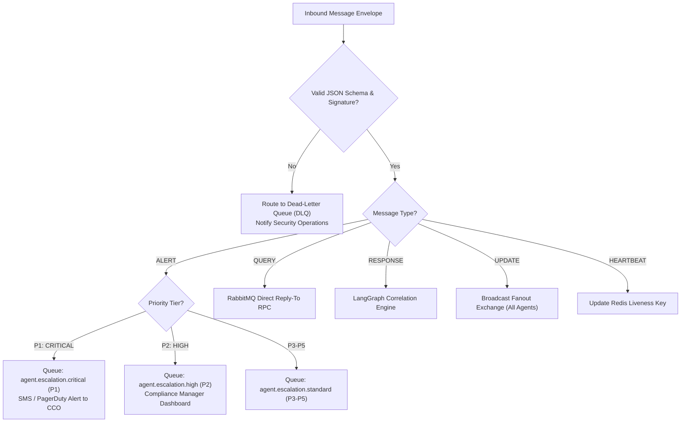

# Message Routing Logic, Priority Queues & Error Handling
**System:** Meridian Global Bank Multi-Agent Compliance Monitoring System (Project 1B)  
**Document Code:** `D2-RL-v1.0`  
**Classification:** Tier-2 Global Banking Architecture Specification  
**Author:** AI Systems Architect, Zetheta Algorithms  

---

## 1. Five-Level Priority Classification & SLAs

The messaging infrastructure implements a rigid 5-level priority classification mapped to RabbitMQ priority queues (`x-max-priority = 5`) and Kafka QoS lanes.

| Priority Tier | Classification | Example Compliance Triggers | Human Escalation SLA | System Routing Latency | Queue Preemption Policy |
| :---: | :--- | :--- | :--- | :--- | :--- |
| **P1** | **CRITICAL** | Active OFAC Sanctions hit (CS-09), $100M+ Market Spoofing (CS-02), Critical Insider Trading (CS-01) | **< 15 Minutes** | < 100 milliseconds | Immediate preemption; interrupts lower-tier worker pools. |
| **P2** | **HIGH** | Chinese Wall breach (CS-05), Cross-Border GDPR violation (CS-11), Coordinated Wash Trading (CS-06) | **< 2 Hours** | < 500 milliseconds | High-priority queue processing; guaranteed dedicated thread allocation. |
| **P3** | **MEDIUM** | Portfolio concentration limit breach (CS-12), Regulatory margin changes (CS-07), Unsuitable recommendations | **< 8 Hours** (Same Day) | < 2 seconds | Standard FIFO queue processing within dedicated worker pool. |
| **P4** | **LOW** | Off-channel WhatsApp chat inquiry (CS-13), Routine supervisory signoff follow-ups | **< 24 Hours** (Next Day) | < 10 seconds | Batched processing during off-peak market trading hours. |
| **P5** | **INFORMATIONAL** | Agent heartbeats, daily throughput metrics, routine model telemetry | **< 72 Hours** (Audit Only) | Best-Effort (< 30s) | Processed when system CPU load is under 50%; droppable under surge. |

---

## 2. Dynamic Routing Matrix

---

## 3. Error Handling, Retry Policies & Dead-Letter Queue (DLQ)

### 3.1 Exponential Backoff with Decorrelated Jitter
When an agent fails to acknowledge an RPC query or report-compilation command, the orchestrator triggers an exponential backoff retry policy designed to prevent thundering herd spikes:

$$T_{\text{sleep}} = \min(T_{\text{max}}, \; T_{\text{base}} \times 2^{\text{retry\_count}}) + \text{Uniform}(0, \text{Jitter})$$

* $T_{\text{base}} = 500\text{ ms}$
* $T_{\text{max}} = 30\text{ seconds}$
* $\text{Max Retries} = 3$

### 3.2 Dead-Letter Queue (DLQ) Quarantine Pipeline
If an envelope fails after 3 retry attempts or fails cryptographic signature validation:
1. The message is wrapped in an `ErrorDiagnosticEnvelope` containing:
   * Original binary payload.
   * Stack trace and error code (`E_SIGNATURE_INVALID`, `E_SCHEMA_MISMATCH`, `E_TIMEOUT`).
   * Route history and retry timestamps.
2. Routed to RabbitMQ Dead-Letter Exchange (`meridian.dlx`) and stored in queue `agent.deadletter.queue`.
3. An alert is dispatched to the Platform Engineering and Security Operations Center (SOC) dashboard.
4. Messages remain in the DLQ for **30 days** to allow offline administrative replay following bug fixes.
