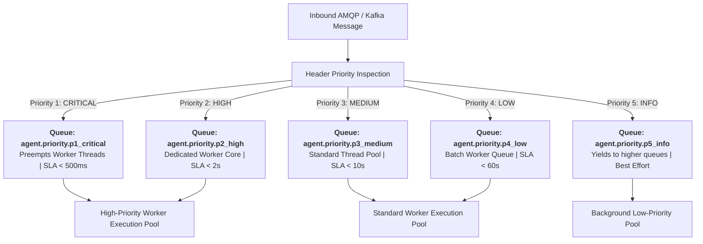
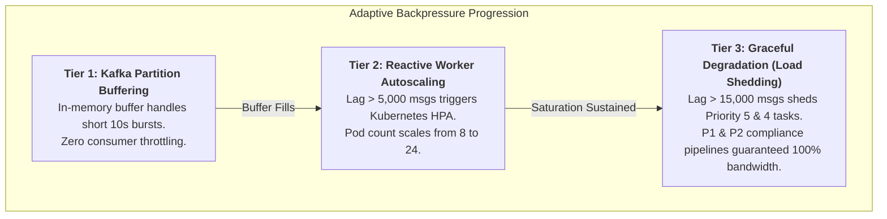

# Message Routing Logic, Priority Queues & Error Handling
**System:** Meridian Global Bank Multi-Agent Compliance Monitoring System (Project 1B)  
**Document Code:** `D2-RL-v2.0`  
**Classification:** Tier-2 Global Banking Architecture Specification  
**Author:** AI Systems Architect, Zetheta Algorithms  

---

## 1. Five-Level Priority Classification & Hard System SLAs

To prevent alert starvation during market volatility bursts, message brokers enforce 5 priority levels (`x-max-priority = 5` in RabbitMQ) governed by legally binding internal SLAs:

```
+---------------------------------------------------------------------------------------------------+
| PRIORITY TIER | CLASSIFICATION | TARGET PROCESSING SLA | SYSTEM ROUTING BUDGET | COMPLIANCE DOMAIN|
+---------------------------------------------------------------------------------------------------+
| Priority 1    | CRITICAL       | < 500 milliseconds    | < 50 milliseconds     | OFAC, Spoofing   |
| Priority 2    | HIGH           | < 2.0 seconds         | < 200 milliseconds    | Chinese Wall, AML|
| Priority 3    | MEDIUM         | < 10.0 seconds        | < 1.0 second          | Margin Changes   |
| Priority 4    | LOW            | < 60.0 seconds        | < 5.0 seconds         | Off-Channel Follow|
| Priority 5    | INFORMATIONAL  | Best Effort (< 300s)  | < 30.0 seconds        | Telemetry, Logs  |
+---------------------------------------------------------------------------------------------------+
```

### 1.1 Priority 1 (CRITICAL): Sub-500ms Processing Mandate
* **Trigger Events:** Real-time OFAC SDN sanctions hit on outgoing SWIFT wires (CS-09), algorithmic crude oil futures spoofing (CS-02), coordinated trade-based money laundering (CS-20).
* **Guaranteed Execution Budget:**
  * Ingestion & schema validation: $\le 20\text{ ms}$
  * Machine model inference & feature lookup: $\le 180\text{ ms}$
  * Dempster-Shafer consensus score calculation: $\le 50\text{ ms}$
  * Priority 1 Queue dispatch & PagerDuty/SMS push to Compliance Officer: $\le 100\text{ ms}$
  * **Total End-to-End Latency:** $\le 350\text{ ms}$ (well below the $500\text{ ms}$ hard SLA ceiling).

---

## 2. Priority Queue Preemption & Queue Architecture



---

## 3. Resilient Error Handling & Retry Policies

### 3.1 Exponential Backoff with Decorrelated Jitter
When an agent or RPC endpoint fails to respond within its timeout window, the coordinator applies exponential backoff with full randomized jitter to prevent synchronous harmonic thundering-herd overload:

$$T_{\text{wait}} = \min(T_{\text{max}}, \; \text{random\_uniform}(T_{\text{base}}, \; T_{\text{base}} \times 2^{\text{retry\_count}}))$$

* **Configuration Parameters:**
  * $T_{\text{base}} = 250\text{ milliseconds}$
  * $T_{\text{max}} = 10\text{ seconds}$
  * $\text{Max Retries} = 3$

### 3.2 Dead-Letter Queue (DLQ) Quarantine Lifecycle
If a message exceeds maximum retries ($R > 3$), encounters a non-recoverable schema violation (`SchemaValidationError`), or fails cryptographic signature validation:
1. **Immediate Quarantine:** The message is moved to the RabbitMQ Dead-Letter Exchange (`meridian.dlx`) and bound to `agent.deadletter.queue`.
2. **Diagnostic Metadata Injection:** An error wrapper is attached containing:
   * `failure_reason`: Exact exception traceback and error code.
   * `originating_broker`: Ingestion timestamp and original topic/queue.
   * `retry_audit_trail`: Millisecond timestamps of all 3 failed delivery attempts.
3. **Retention & Admin Replay:** DLQ messages persist for **30 days** in hot storage. Operations engineers can inspect, re-validate, and replay dead-letter messages to live agent queues via management CLI tools (`scripts/replay_dlq.py`).

---

## 4. Bandwidth Management & Adaptive Backpressure Controls

When processing 2.4 million daily transactions, market volatility spikes (e.g., non-farm payroll announcements, earnings releases) can surge transaction arrival rates from a baseline of 30 txns/sec to **35,000 txns/sec**. The routing layer maintains system stability through three tiered backpressure mechanisms:



1. **Kafka Partition Buffering:** High-throughput NVMe storage on Kafka broker nodes acts as a shock absorber, absorbing bursts without dropping a single event.
2. **Dynamic Consumer Autoscaling:** Kubernetes Horizontal Pod Autoscaler (HPA) monitors consumer group lag. If lag exceeds 5,000 records on `meridian.transactions.v1`, worker pods scale from 8 to 24 within 45 seconds.
3. **Graceful Surveillance Degradation:** If consumer lag exceeds 15,000 records, the routing gateway throttles low-priority tasks (e.g., historical report compilations and informational heartbeats), guaranteeing that **100% of compute capacity is reserved for Priority 1 and Priority 2 compliance monitoring**.
